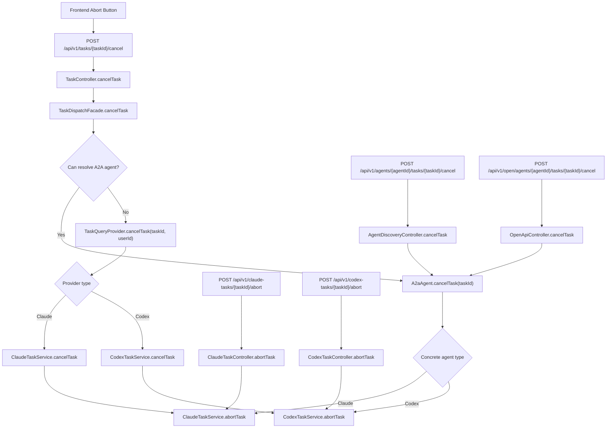
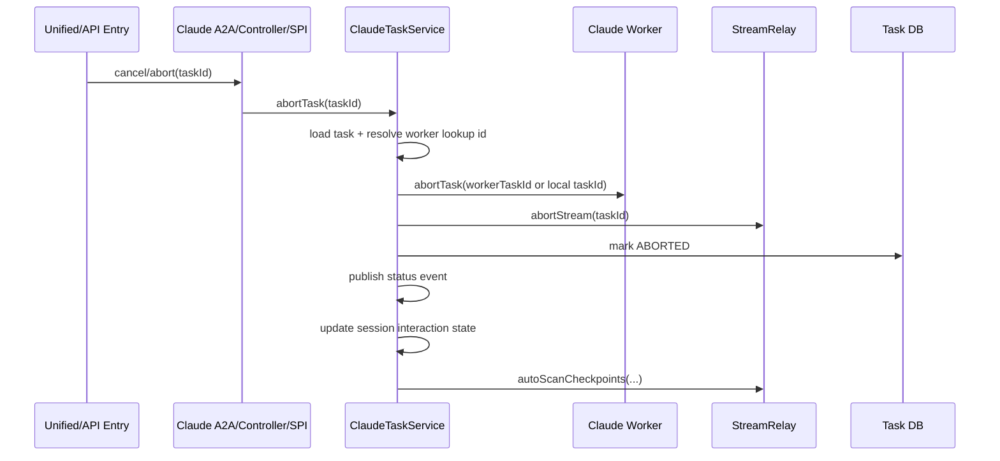
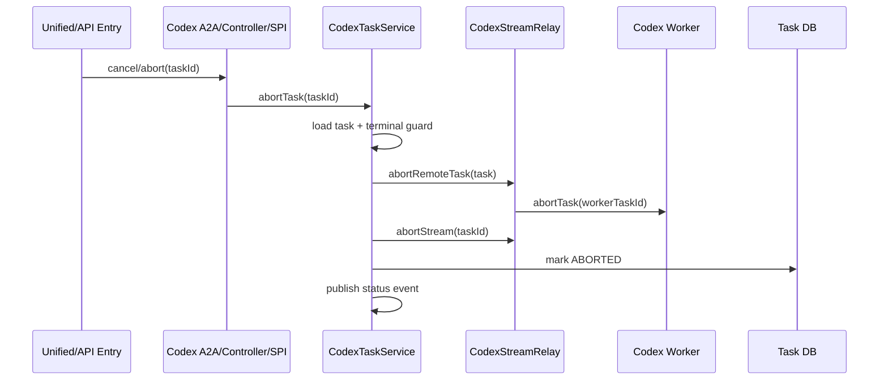
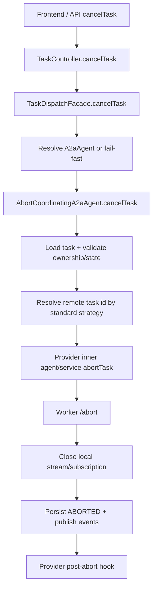

# 03 Abort Task Entry Flow Analysis

## Date

- 2026-04-03

## Type

- Analysis
- Architecture

## Scope

本文分析当前代码中与任务中止相关的入口与调用链，覆盖：

- `session-module`
- `addons/claude-worker-agent`
- `addons/codex-worker-agent`
- `packages/navigator-frontend`

不包含跨项目任务 `CrossProjectTask` 的取消链路；该链路是独立上下文模型，不属于统一 `taskId` 取消体系。

## Purpose

本次分析关注三个问题：

1. 当前 `abortTask` / `cancelTask` 一共有多少入口
2. Claude Agent 与 Codex Agent 分别如何落到各自的 Worker 中止逻辑
3. 这套设计是否合理，是否便于后续接入更多 `A2aAgent`

## Entry List

当前与任务中止直接相关的入口可以分成三层。

### 1. 前端统一取消入口

- 默认 UI 中止动作：`packages/navigator-frontend/src/composables/useClaudeWorker.ts`
- 真实调用：`packages/navigator-frontend/src/api/unifiedTask.ts`
- API：`POST /api/v1/tasks/{taskId}/cancel`

这条链路不是直接调用 Claude/Codex 自己的 `/abort` 接口，而是先进入 `session-module` 的统一取消入口。

### 2. Session Module 统一 / A2A 入口

- 统一取消：`session-module/.../controller/TaskController.java`
- A2A 直连取消：`session-module/.../controller/AgentDiscoveryController.java`
- A2A 包装：`session-module/.../agent/ContextResolvingA2aAgent.java`
- 统一路由：`session-module/.../service/TaskDispatchFacade.java`
- Claude Open API A2A 取消：`addons/claude-worker-agent/.../controller/openapi/OpenApiController.java`

这里负责决定本次中止到底走：

- `A2aAgent.cancelTask(taskId)`
- 还是 `TaskQueryProvider.cancelTask(taskId, userId)`

### 3. Provider 自身中止入口

- Claude Controller：`addons/claude-worker-agent/.../controller/ClaudeTaskController.java`
- Codex Controller：`addons/codex-worker-agent/.../controller/CodexTaskController.java`
- Claude A2A Agent：`addons/claude-worker-agent/.../adapter/ClaudeWorkerInnerA2aAgent.java`
- Codex A2A Agent：`addons/codex-worker-agent/.../adapter/CodexWorkerInnerA2aAgent.java`
- Claude SPI：`addons/claude-worker-agent/.../spi/ClaudeWorkerFacadeImpl.java`
- Codex SPI：`addons/codex-worker-agent/.../spi/CodexWorkerFacadeImpl.java`

这些入口最终都应当收敛到各自 Provider 的 `TaskService.abortTask(...)`。

## Overall Flow

## Unified Cancel Flow

统一取消链路的关键点在 `TaskDispatchFacade.cancelTask(...)`：

1. 先根据 `agentId` 和上下文解析 `A2aAgent`
2. 如果能解析成功，优先走 `agent.cancelTask(taskId)`
3. 如果不能解析，才退回 `TaskQueryProvider.cancelTask(taskId, userId)`

这意味着当前平台的“统一中止”本质上是一个路由入口，不是真正执行中止动作的地方；真正的中止语义仍然由 Claude/Codex 各自的服务层定义。

## Clarification: Agent Resolution vs Remote Task ID Resolution

这里有两个容易混淆的“解析”动作，它们不是一回事。

### 1. Agent Resolution

这是 `session-module` 在创建任务或取消任务时做的解析，目标是：

- 根据 `agentId`
- 必要时结合 `providerType` / `modelConfigId`
- 找到真正要调用的 `A2aAgent`

这层解决的是“本次请求应该发给哪个 Agent”。

### 2. Remote Task ID Resolution

这是 Provider 在执行 `abort/status/subscribe` 时做的解析，目标是：

- 根据平台侧任务实体
- 找到 Worker 真正认识的那个任务标识

这层解决的是“已经定位到 Agent 之后，通知 Worker 时到底该传哪个 task id”。

它和 `agentId + modelConfigId` 找 Agent 不是一个问题。前者是 Agent 路由，后者是平台任务与 Worker 任务的标识映射。

### Why Remote Task ID Resolution Still Matters

标准化这层解析的作用，是统一回答下面几个问题：

1. Worker 应该优先吃 `workerTaskId` 还是平台 `taskId`
2. 如果 `workerTaskId` 缺失，是否允许回退到平台 `taskId`
3. 如果两者都不可用，是直接失败还是记录告警并跳过
4. `abort`、`status`、`subscribe` 是否必须复用同一套解析规则

它解决的问题主要有四类：

1. 不同 Provider 可能保存不同的上游标识
   - Claude 既可能用 `workerTaskId`，也支持平台 `taskId` 别名
   - Codex 当前更依赖 `workerTaskId`

2. 同一个 Provider 在不同操作上容易出现“解析规则分叉”
   - `abort` 一套
   - `status` 一套
   - `subscribe` 又一套
   - 一旦分叉，就会出现“能查状态但不能中止”之类的问题

3. 当创建阶段没有及时写回 `workerTaskId` 时，系统需要有统一兜底策略
   - 是允许临时用平台 `taskId`
   - 还是直接视为异常
   - 这不应该由每个 service 临时拍脑袋决定

4. 后续增加新 Provider 时，最容易重复造轮子的就是这一层
   - 如果没有标准件，新 Provider 会再实现一套自己的 `resolveXxxLookupId`
   - 最终平台只统一了入口，没有统一底层任务标识协议

所以，这里说的“标准化远端任务标识解析”，不是回到旧版本再做一套 agent lookup，而是把“平台 task 如何映射到 Worker task”收敛成统一约束。

## Claude Flow

Claude 当前有四条主要入口会收敛到 `ClaudeTaskService.abortTask(taskId)`：

- `TaskDispatchFacade -> ClaudeWorkerInnerA2aAgent.cancelTask(...)`
- `OpenApiController -> agent.cancelTask(...) -> ClaudeWorkerInnerA2aAgent.cancelTask(...)`
- `ClaudeTaskController.abortTask(...)`
- `ClaudeWorkerFacadeImpl.abortTask(...)`

Claude 的 service 侧流程如下：

1. 查询任务实体
2. 解析 Worker 侧 lookup id
3. 调用 Claude Worker `/abort`
4. 本地 `streamRelay.abortStream(taskId)`
5. 更新数据库状态为 `ABORTED`
6. 发布状态事件
7. 更新 session interaction state 为 `AWAITING_REPLY`
8. 触发 checkpoint 扫描

### Claude 的当前特征

- `cancelTask(taskId, userId)` 不限制当前任务状态，校验归属后直接转 `abortTask(taskId)`
- `abortTask(taskId)` 没有显式 terminal-state guard
- 远端 abort 优先使用 `workerTaskId`，没有时回退到本地 `taskId`
- 还带有 session / checkpoint 的额外副作用

## Codex Flow

Codex 当前也有三条主要入口收敛到 `CodexTaskService.abortTask(taskId)`：

- `TaskDispatchFacade -> CodexWorkerInnerA2aAgent.cancelTask(...)`
- `CodexTaskController.abortTask(...)`
- `CodexWorkerFacadeImpl.abortTask(...)`

Codex 的 service 侧流程如下：

1. 查询任务实体
2. 判断是否已经处于 terminal state
3. 通知远端 Worker abort
4. 本地 `streamRelay.abortStream(taskId)`
5. 更新数据库状态为 `ABORTED`
6. 发布状态事件

### Codex 的当前特征

- `cancelTask(taskId, userId)` 只处理中间态：`RUNNING` / `AWAITING_PERMISSION`
- `abortTask(taskId)` 自带 terminal-state guard，重复中止更安全
- 远端 abort 依赖 upstream `workerTaskId`
- 没有 Claude 那样的 session interaction state / checkpoint 副作用

## Entry Comparison

| 维度 | Claude | Codex |
|------|--------|-------|
| A2A 取消落点 | `taskService.abortTask` | `taskService.abortTask` |
| Provider `/abort` 落点 | `taskService.abortTask` | `taskService.abortTask` |
| SPI 落点 | `taskService.abortTask` | `taskService.abortTask` |
| `cancelTask(userId)` 状态限制 | 无 | 仅中间态 |
| `abortTask()` terminal guard | 无 | 有 |
| 远端 abort lookup | `workerTaskId`，缺失时回退本地 `taskId` | 依赖 `workerTaskId` |
| abort 后附加副作用 | 更新 interaction state、扫描 checkpoint | 无 |

## Is The Current Flow Reasonable?

结论是：整体方向合理，但“接口统一、语义不统一”的问题仍然明显。

### 合理的部分

1. `session-module` 负责统一取消入口，Provider 不必暴露给前端
2. `TaskDispatchFacade` 先 A2A、后 provider fallback，符合“逻辑 Agent 优先”的路由设计
3. Claude/Codex 都已经把 controller、A2A、SPI 入口收敛到 service 层，避免了多处各自实现中止逻辑

### 当前不够合理的部分

1. `cancelTask` 与 `abortTask` 的职责边界不统一
   - 有的 Provider 在 `cancelTask` 做状态判断
   - 有的 Provider 直接把 `cancelTask` 当作 `abortTask` 的别名

2. Provider 的中止副作用差异较大
   - Claude 有 interaction state / checkpoint 逻辑
   - Codex 没有
   - 这导致“统一取消”只统一了入口，没有统一行为契约

3. 远端 abort 的 lookup 规则不一致
   - Claude 可以回退到本地 `taskId`
   - Codex 强依赖 `workerTaskId`
   - 后续新 Provider 很容易在“任务标识映射”这里再长出第三种语义

4. 目前仍保留三类入口
   - 统一 `/tasks/{id}/cancel`
   - A2A 直连 `/agents/{agentId}/tasks/{taskId}/cancel`
   - Provider `/abort`
   - 这对兼容性有好处，但如果没有严格约束，行为很容易漂移

## Is It Easy To Add More A2aAgent Later?

结论是：可以扩，但还不算低成本扩展。

### 现有设计对扩展有利的部分

1. `TaskDispatchFacade` 已经把“入口路由”和“Provider 具体实现”隔离开了
2. 新 Agent 只要实现 `A2aAgent.cancelTask(taskId)`，统一入口就能接入
3. 仍然保留 `TaskQueryProvider.cancelTask(...)` fallback，便于兼容非 A2A Provider

### 现有设计对扩展不利的部分

1. 新 Agent 需要自己决定 `cancelTask` 与 `abortTask` 的关系
2. 新 Agent 需要自己定义远端 task lookup 规则
3. 新 Agent 需要自己决定 terminal-state guard 和 abort 后副作用
4. 如果没有额外约束，不同 Agent 只会复用入口，不会复用取消语义

换句话说，当前架构已经具备“接入能力”，但还没有形成“中止语义标准件”。

## Decision

下面这些是基于本次分析形成的目标决策，不再只是备选建议。

### Decision 1: 去掉 `cancelTask` 中“找不到 A2A Agent 就 fallback 到 Provider”的分支

`TaskDispatchFacade.cancelTask(...)` 当前还保留：

- 能解析到 `A2aAgent` 就走 `agent.cancelTask(taskId)`
- 解析不到时退回 `TaskQueryProvider.cancelTask(taskId, userId)`

这个分支对早期兼容有价值，但在 A2A 体系已经稳定之后，会把“统一取消”的语义再次拆成两套。

后续目标是：

1. `cancelTask` 只走 A2A
2. 找不到 `A2aAgent` 就 fail-fast
3. Provider 不再单独承担统一取消入口的业务编排职责

这样才能把中止业务真正收敛到 A2A 装饰层。

### Decision 2: 平台对外保留 `cancelTask`，Provider/Worker 内部统一为 `abortTask`

这里不建议把所有层都改名成 `abortTask`。

建议统一语义为：

- 平台入口、A2A 接口、前端用户动作：`cancelTask`
- Provider service、Worker client、真正执行中止的内部动作：`abortTask`

原因是：

1. `cancelTask` 更像平台域语义，表达“用户请求取消当前任务”
2. `abortTask` 更像执行语义，表达“对正在运行的 Worker 任务发出中止信号”
3. 对外保留 `cancelTask`，兼容现有 API / A2A 协议 / 前端交互成本最低
4. 对内统一 `abortTask`，可以明确“真正停止执行”的唯一动作

也就是说，建议不是“选一个名字全平台覆盖”，而是“对外 cancel、对内 abort，各司其职”。

### Decision 3: 把中止业务统一下沉到 A2A 装饰层

这次分析后的目标不是让 `ClaudeAgent`、`CodexAgent` 自己各写一套完整中止业务，而是：

1. `TaskDispatchFacade.cancelTask(...)` 只负责找到正确的 A2A Agent
2. A2A 装饰层统一处理中止业务模板
3. Claude/Codex 这样的具体 Agent 只负责连接自己的 Worker，并执行内部 `abortTask`

目标形态类似：

- `A2aAgent.cancelTask(taskId)`：平台入口语义
- `AbortCoordinatingA2aAgent.cancelTask(taskId)`：统一做状态校验、幂等、事件、副作用编排
- `Claude/Codex inner agent`：只负责把 `abortTask` 发给对应 Worker

当前 `ContextResolvingA2aAgent` 已经说明“装饰层复用”这条路是成立的。中止业务适合继续放在同类装饰对象里，而不是继续散在各个 Controller / Facade / Service。

### Decision 4: 标准化远端任务标识解析，但它只负责“任务 ID 映射”，不负责“Agent 路由”

这里的标准化范围要收窄说明：

- 不再回到旧版本那种“多套 agent lookup”
- 也不是重新定义 `agentId + modelConfigId` 的解析流程
- 它只负责把“平台 taskId / taskEntity”映射成“Worker 能识别的任务标识”

统一后，每个 Provider 至少要回答同一组问题：

1. 优先使用哪个上游 task id
2. 是否允许 fallback
3. fallback 的前提条件是什么
4. `abort/status/subscribe` 是否强制共用同一策略

## Target Flow After Decision

## Why This Decision Is Better

### 对删除 Provider fallback 的收益

1. `cancelTask` 只有一条业务主链，排障更直接
2. 后续新增 Agent 时，不需要再同时实现 A2A 取消和 Provider fallback 取消两套入口
3. `TaskDispatchFacade` 的职责更纯粹，只做路由，不做兜底业务分支

### 对“对外 cancel / 对内 abort”的收益

1. 平台语义和执行语义不再混淆
2. 外部接口不需要大规模改名
3. 内部实现可以把 `abortTask` 明确为唯一中止动作

### 对装饰层统一中止业务的收益

1. Claude/Codex 的差异只保留在 Worker 适配
2. 幂等、状态校验、副作用这些横切逻辑只实现一次
3. 新增 A2A Agent 的成本从“复制一整套中止流程”下降为“实现 Worker abort 适配”

### 对远端任务标识解析标准化的收益

1. `abort/status/subscribe` 使用同一套 task id 映射规则
2. 不会再出现某个 Provider 只有 abort 能找到任务、status 却找不到，或者反过来的问题
3. 新 Provider 接入时，有明确模板可套，不需要重复设计标识映射逻辑

## Implementation Landing Points

如果按上述决策落地，建议优先改下面几个位置。

### 1. `TaskDispatchFacade.cancelTask(...)`

- 去掉 Provider fallback
- 解析不到 `A2aAgent` 时直接失败
- 保持 Facade 只做路由和绑定校验

### 2. A2A 装饰层

- 在现有 `ContextResolvingA2aAgent` 同层新增一个专门处理中止业务的装饰者
- 或者扩展现有装饰链，让 `cancelTask` 进入统一模板
- 统一处理权限校验、状态校验、幂等和 post-abort hook 编排

### 3. Provider 内部语义

要求每个 Provider 明确区分：

- `cancelTask(taskId, userId)`：面向外部入口，负责权限与状态合法性
- `abortTask(taskId)`：面向内部执行，负责远端终止、流清理、本地状态落库、事件发布

但在目标方案下，A2A 主链最终应尽量只落到统一装饰层和内部 `abortTask(taskId)`，而不是继续让多个 Controller / Provider 各自编排中止业务。

### 4. 抽取统一的 abort 生命周期模板

建议后续统一为同一组步骤：

1. 加载任务
2. terminal-state guard
3. 解析远端 lookup id
4. 调用远端 abort
5. 关闭本地 stream/subscription
6. 更新本地任务状态
7. 发布事件
8. 执行 Provider 专属 post-abort hook

Claude/Codex 的差异只保留在：

- lookup 解析
- remote client 调用
- post-abort hook

### 5. 标准化远端任务标识解析

建议统一抽象一个“远端任务标识解析策略”，而不是每个 Provider 自己散落在 service/relay 中决定：

- 优先 `workerTaskId`
- 是否允许回退本地 `taskId`
- 缺失时是 fail-fast 还是 warn-and-skip

### 6. 定义平台级“取消成功”语义

当前“取消成功”至少可能有三种含义：

- 已成功通知远端
- 已关闭本地流
- 已把本地 DB 状态改成 `ABORTED`

后续新增 Provider 前，必须先定义平台级成功语义，否则不同 Agent 的“取消成功”会继续不一致。

## Suggested Analysis Checklist

下面这份清单是建议技术同学优先从这些点开始分析代码，不是强制拆解顺序。

### Session / Routing Layer

1. 检查 `TaskDispatchFacade.cancelTask(...)`
   - 去掉 Provider fallback 后，是否还有调用方依赖当前兜底行为
   - `agentId` 的补齐逻辑是否足够稳定
   - fail-fast 后错误信息是否对前端可读

2. 检查 `TaskController.cancelTask(...)`
   - 当请求体未传 `agentId` 时，是否总能从 task 记录补齐
   - 对历史数据或异常数据是否需要兼容提示

3. 检查 `AgentDiscoveryController.cancelTask(...)`
   - 与统一 `/tasks/{taskId}/cancel` 的行为是否完全一致
   - 是否仍然允许保留为 A2A 调试/直连入口

### A2A Decorator Layer

1. 评估是在 `ContextResolvingA2aAgent` 同层新增中止装饰者，还是直接扩展现有装饰链
2. 明确统一装饰层需要承担的职责：
   - 权限校验
   - 状态校验
   - terminal-state 幂等
   - 统一事件发布
   - Provider post-abort hook 调度

3. 明确具体 Agent 的职责边界：
   - Claude/Codex inner agent 只负责 Worker abort 适配
   - 不再负责完整中止业务编排

### Provider Layer

1. 检查 Claude / Codex 的 `abortTask(...)` 是否都能成为唯一内部执行动作
2. 识别当前还存在的重复编排逻辑：
   - controller 层
   - facade / spi 层
   - service 层
   - relay 层

3. 明确哪些副作用属于统一模板，哪些属于 Provider hook：
   - stream 清理
   - 状态落库
   - 事件发布
   - session interaction state
   - checkpoint 扫描

### Remote Task ID Resolution

1. 梳理 Claude / Codex 当前 `abort/status/subscribe/reconnect` 使用的 task id 来源
2. 确认是否存在不一致：
   - `abort` 用 `workerTaskId`
   - `status` 用平台 `taskId`
   - `subscribe` 又走第三套

3. 先定义统一策略，再回头删各模块自己的临时 lookup 逻辑

## Acceptance Criteria

下面这些是建议作为本次重构的验收标准。

### Functional Acceptance

1. 统一入口 `POST /api/v1/tasks/{taskId}/cancel` 不再走 `TaskQueryProvider.cancelTask(...)` fallback。
2. `TaskDispatchFacade.cancelTask(...)` 在无法解析 `A2aAgent` 时直接失败，并返回可定位原因的错误信息。
3. 平台对外仍使用 `cancelTask` 语义，Provider/Worker 内部统一使用 `abortTask` 语义。
4. Claude 与 Codex 的 A2A 取消都必须经过统一装饰层，而不是各自单独编排完整中止流程。
5. Claude 与 Codex 的内部 `abortTask(...)` 都必须成为真实中止执行的唯一内部动作。
6. `abort/status/subscribe` 对远端任务标识的解析规则必须一致，不允许同一 Provider 内多套规则并存。
7. 对已处于 terminal state 的任务重复取消时，行为必须幂等，不能出现二次副作用或状态污染。

### Compatibility Acceptance

1. 现有前端中止按钮行为不变，仍然通过统一入口发起取消。
2. `AgentDiscoveryController.cancelTask(...)` 与统一入口的中止语义保持一致。
3. Provider 自身 `/abort` 端点如果继续保留，必须复用同一内部 `abortTask(...)`，不能另起一套中止流程。

### Observability Acceptance

1. 当取消失败时，日志中必须能区分：
   - A2A agent 解析失败
   - 权限校验失败
   - 远端 Worker abort 失败
   - 远端 task id 解析失败

2. 当任务已被成功中止时，至少要能在日志或状态事件中确认：
   - 远端 abort 已发出
   - 本地 stream/subscription 已关闭
   - 本地任务状态已进入 `ABORTED`

## Test Scope

本次改造建议至少覆盖下面这些测试。

### Unit Tests

1. `session-module`
   - `TaskDispatchFacade.cancelTask(...)` 成功走 A2A
   - `TaskDispatchFacade.cancelTask(...)` 在解析不到 A2A Agent 时 fail-fast
   - `TaskController.cancelTask(...)` 能正确补齐 `agentId`

2. `addons/claude-worker-agent`
   - Claude A2A cancel 最终落到统一装饰层/内部 `abortTask(...)`
   - Claude `abortTask(...)` 对 terminal-state / 幂等行为符合统一约束
   - Claude 的 post-abort hook 仍然保留 interaction state / checkpoint 行为

3. `addons/codex-worker-agent`
   - Codex A2A cancel 最终落到统一装饰层/内部 `abortTask(...)`
   - Codex `abortTask(...)` 对远端 Worker abort、stream 清理、状态更新顺序正确
   - Codex 的 terminal-state guard 与统一契约一致

### Integration / Regression Tests

1. 统一取消接口回归
   - 创建 Claude 任务后调用 `/api/v1/tasks/{taskId}/cancel`
   - 创建 Codex 任务后调用 `/api/v1/tasks/{taskId}/cancel`
   - 验证都不再依赖 Provider fallback

2. A2A 直连取消回归
   - 调用 `/api/v1/agents/{agentId}/tasks/{taskId}/cancel`
   - 验证与统一入口行为一致

3. Provider `/abort` 回归
   - Claude `/api/v1/claude-tasks/{taskId}/abort`
   - Codex `/api/v1/codex-tasks/{taskId}/abort`
   - 验证两者确实复用统一内部 `abortTask(...)`

4. 重复取消回归
   - 对同一任务执行两次取消
   - 验证不会产生重复副作用

5. 远端任务标识解析回归
   - 有 `workerTaskId`
   - 无 `workerTaskId`
   - fallback 允许 / 不允许两种情形
   - 验证 `abort/status/subscribe` 使用同一规则

### Frontend / Playwright Validation

建议补一个最小可用的 `playwright-cli` 验证脚本或手工用例，至少覆盖：

1. 打开任务列表页或 `ClaudeWorkerView`
2. 启动一个 Claude 任务，等待进入运行态
3. 点击“中止任务”
4. 验证前端状态最终进入 `ABORTED`
5. 刷新页面后，状态仍保持一致
6. 如果页面支持重试点击，再次点击“中止任务”不应出现异常状态

如果测试环境可同时覆盖 Codex：

1. 再启动一个 Codex 任务
2. 执行相同中止流程
3. 验证前端状态、后端状态、Worker 实际停止行为一致

### Manual Verification Checklist

1. Claude 任务中止后：
   - Worker abort 被调用
   - 本地流关闭
   - 状态进入 `ABORTED`
   - interaction state / checkpoint 行为符合预期

2. Codex 任务中止后：
   - Worker abort 被调用
   - 本地流关闭
   - 状态进入 `ABORTED`
   - 不应再出现“前端已中止但 CLI 继续跑”的状态漂移

3. 对不存在或不可解析 Agent 的任务执行统一取消：
   - 请求失败
   - 错误信息可定位
   - 不会悄悄落到 Provider fallback

## Summary

当前 `abortTask` 体系已经完成了入口收敛，前端和 session-module 不需要知道 Claude/Codex 的具体中止细节，这一点是合理的。

但从这次决策来看，后续方向已经比较明确：

- `cancelTask` 不再保留 Provider fallback
- 对外保留 `cancelTask`，对内统一 `abortTask`
- 中止业务收敛到 A2A 装饰层
- 远端任务标识解析收敛为统一策略

真正需要控制住的，不再是“入口够不够多”，而是下面这些横切规则：

- 中止前状态校验
- 远端任务标识解析
- abort 后副作用
- terminal-state 的幂等处理

只要把这些规则固化到装饰层和统一模板里，后续增加新的 `A2aAgent` 就会从“复制行为”转成“补 Worker 适配”，扩展成本会明显下降。
