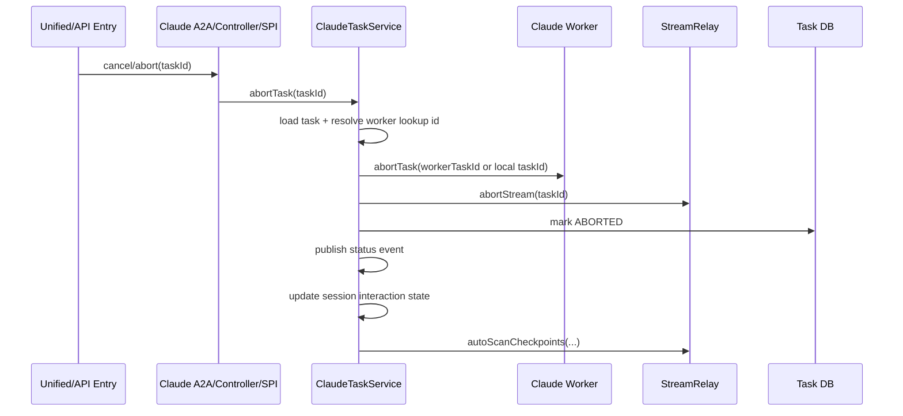
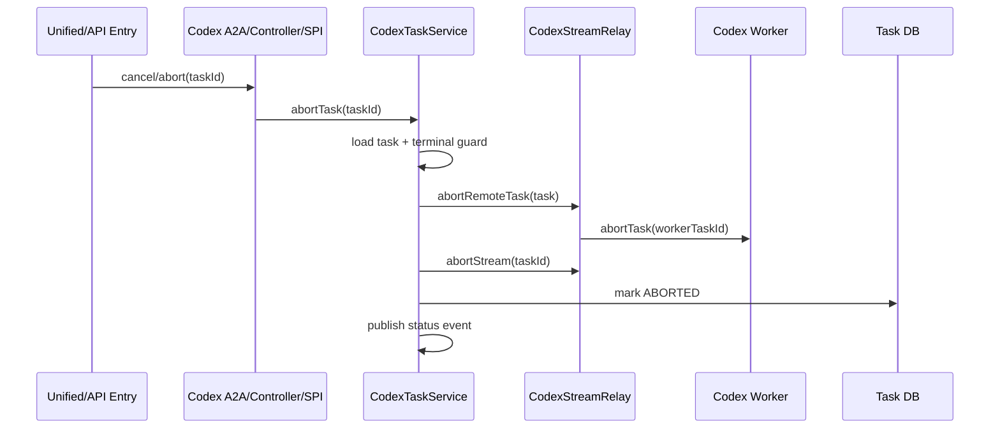

# 03 Abort Task Entry Flow Analysis

## Date

- 2026-04-03

## Type

- Analysis
- Architecture

## Scope

本文分析当前代码中与任务中止相关的入口与调用链，覆盖：

- `session-module`
- `addons/claude-worker-agent`
- `addons/codex-worker-agent`
- `packages/navigator-frontend`

不包含跨项目任务 `CrossProjectTask` 的取消链路；该链路是独立上下文模型，不属于统一 `taskId` 取消体系。

## Purpose

本次分析关注三个问题：

1. 当前 `abortTask` / `cancelTask` 一共有多少入口
2. Claude Agent 与 Codex Agent 分别如何落到各自的 Worker 中止逻辑
3. 这套设计是否合理，是否便于后续接入更多 `A2aAgent`

## Entry List

当前与任务中止直接相关的入口可以分成三层。

### 1. 前端统一取消入口

- 默认 UI 中止动作：`packages/navigator-frontend/src/composables/useClaudeWorker.ts`
- 真实调用：`packages/navigator-frontend/src/api/unifiedTask.ts`
- API：`POST /api/v1/tasks/{taskId}/cancel`

这条链路不是直接调用 Claude/Codex 自己的 `/abort` 接口，而是先进入 `session-module` 的统一取消入口。

### 2. Session Module 统一 / A2A 入口

- 统一取消：`session-module/.../controller/TaskController.java`
- A2A 直连取消：`session-module/.../controller/AgentDiscoveryController.java`
- A2A 包装：`session-module/.../agent/ContextResolvingA2aAgent.java`
- 统一路由：`session-module/.../service/TaskDispatchFacade.java`
- Claude Open API A2A 取消：`addons/claude-worker-agent/.../controller/openapi/OpenApiController.java`

这里负责决定本次中止到底走：

- `A2aAgent.cancelTask(taskId)`
- 还是 `TaskQueryProvider.cancelTask(taskId, userId)`

### 3. Provider 自身中止入口

- Claude Controller：`addons/claude-worker-agent/.../controller/ClaudeTaskController.java`
- Codex Controller：`addons/codex-worker-agent/.../controller/CodexTaskController.java`
- Claude A2A Agent：`addons/claude-worker-agent/.../adapter/ClaudeWorkerInnerA2aAgent.java`
- Codex A2A Agent：`addons/codex-worker-agent/.../adapter/CodexWorkerInnerA2aAgent.java`
- Claude SPI：`addons/claude-worker-agent/.../spi/ClaudeWorkerFacadeImpl.java`
- Codex SPI：`addons/codex-worker-agent/.../spi/CodexWorkerFacadeImpl.java`

这些入口最终都应当收敛到各自 Provider 的 `TaskService.abortTask(...)`。

## Overall Flow

```mermaid
flowchart TD
    A[Frontend Abort Button] --> B[POST /api/v1/tasks/{taskId}/cancel]
    B --> C[TaskController.cancelTask]
    C --> D[TaskDispatchFacade.cancelTask]
    D --> E{Can resolve A2A agent?}
    E -->|Yes| F[A2aAgent.cancelTask(taskId)]
    E -->|No| G[TaskQueryProvider.cancelTask(taskId, userId)]

    H[POST /api/v1/agents/{agentId}/tasks/{taskId}/cancel] --> I[AgentDiscoveryController.cancelTask]
    I --> F

    J[POST /api/v1/claude-tasks/{taskId}/abort] --> K[ClaudeTaskController.abortTask]
    K --> L[ClaudeTaskService.abortTask]

    M[POST /api/v1/codex-tasks/{taskId}/abort] --> N[CodexTaskController.abortTask]
    N --> O[CodexTaskService.abortTask]

    T[POST /api/v1/open/agents/{agentId}/tasks/{taskId}/cancel] --> U[OpenApiController.cancelTask]
    U --> F

    F --> P{Concrete agent type}
    P -->|Claude| L
    P -->|Codex| O

    G --> Q{Provider type}
    Q -->|Claude| R[ClaudeTaskService.cancelTask]
    Q -->|Codex| S[CodexTaskService.cancelTask]
    R --> L
    S --> O
```

## Unified Cancel Flow

统一取消链路的关键点在 `TaskDispatchFacade.cancelTask(...)`：

1. 先根据 `agentId` 和上下文解析 `A2aAgent`
2. 如果能解析成功，优先走 `agent.cancelTask(taskId)`
3. 如果不能解析，才退回 `TaskQueryProvider.cancelTask(taskId, userId)`

这意味着当前平台的“统一中止”本质上是一个路由入口，不是真正执行中止动作的地方；真正的中止语义仍然由 Claude/Codex 各自的服务层定义。

## Claude Flow

Claude 当前有三条主要入口会收敛到 `ClaudeTaskService.abortTask(taskId)`：

- `TaskDispatchFacade -> ClaudeWorkerInnerA2aAgent.cancelTask(...)`
- `OpenApiController -> agent.cancelTask(...) -> ClaudeWorkerInnerA2aAgent.cancelTask(...)`
- `ClaudeTaskController.abortTask(...)`
- `ClaudeWorkerFacadeImpl.abortTask(...)`

Claude 的 service 侧流程如下：

1. 查询任务实体
2. 解析 Worker 侧 lookup id
3. 调用 Claude Worker `/abort`
4. 本地 `streamRelay.abortStream(taskId)`
5. 更新数据库状态为 `ABORTED`
6. 发布状态事件
7. 更新 session interaction state 为 `AWAITING_REPLY`
8. 触发 checkpoint 扫描



### Claude 的当前特征

- `cancelTask(taskId, userId)` 不限制当前任务状态，校验归属后直接转 `abortTask(taskId)`
- `abortTask(taskId)` 没有显式 terminal-state guard
- 远端 abort 优先使用 `workerTaskId`，没有时回退到本地 `taskId`
- 还带有 session / checkpoint 的额外副作用

## Codex Flow

Codex 当前也有三条主要入口收敛到 `CodexTaskService.abortTask(taskId)`：

- `TaskDispatchFacade -> CodexWorkerInnerA2aAgent.cancelTask(...)`
- `CodexTaskController.abortTask(...)`
- `CodexWorkerFacadeImpl.abortTask(...)`

Codex 的 service 侧流程如下：

1. 查询任务实体
2. 判断是否已经处于 terminal state
3. 通知远端 Worker abort
4. 本地 `streamRelay.abortStream(taskId)`
5. 更新数据库状态为 `ABORTED`
6. 发布状态事件



### Codex 的当前特征

- `cancelTask(taskId, userId)` 只处理中间态：`RUNNING` / `AWAITING_PERMISSION`
- `abortTask(taskId)` 自带 terminal-state guard，重复中止更安全
- 远端 abort 依赖 upstream `workerTaskId`
- 没有 Claude 那样的 session interaction state / checkpoint 副作用

## Entry Comparison

| 维度 | Claude | Codex |
|------|--------|-------|
| A2A 取消落点 | `taskService.abortTask` | `taskService.abortTask` |
| Provider `/abort` 落点 | `taskService.abortTask` | `taskService.abortTask` |
| SPI 落点 | `taskService.abortTask` | `taskService.abortTask` |
| `cancelTask(userId)` 状态限制 | 无 | 仅中间态 |
| `abortTask()` terminal guard | 无 | 有 |
| 远端 abort lookup | `workerTaskId`，缺失时回退本地 `taskId` | 依赖 `workerTaskId` |
| abort 后附加副作用 | 更新 interaction state、扫描 checkpoint | 无 |

## Is The Current Flow Reasonable?

结论是：整体方向合理，但“接口统一、语义不统一”的问题仍然明显。

### 合理的部分

1. `session-module` 负责统一取消入口，Provider 不必暴露给前端
2. `TaskDispatchFacade` 先 A2A、后 provider fallback，符合“逻辑 Agent 优先”的路由设计
3. Claude/Codex 都已经把 controller、A2A、SPI 入口收敛到 service 层，避免了多处各自实现中止逻辑

### 当前不够合理的部分

1. `cancelTask` 与 `abortTask` 的职责边界不统一
   - 有的 Provider 在 `cancelTask` 做状态判断
   - 有的 Provider 直接把 `cancelTask` 当作 `abortTask` 的别名

2. Provider 的中止副作用差异较大
   - Claude 有 interaction state / checkpoint 逻辑
   - Codex 没有
   - 这导致“统一取消”只统一了入口，没有统一行为契约

3. 远端 abort 的 lookup 规则不一致
   - Claude 可以回退到本地 `taskId`
   - Codex 强依赖 `workerTaskId`
   - 后续新 Provider 很容易在“任务标识映射”这里再长出第三种语义

4. 目前仍保留三类入口
   - 统一 `/tasks/{id}/cancel`
   - A2A 直连 `/agents/{agentId}/tasks/{taskId}/cancel`
   - Provider `/abort`
   - 这对兼容性有好处，但如果没有严格约束，行为很容易漂移

## Is It Easy To Add More A2aAgent Later?

结论是：可以扩，但还不算低成本扩展。

### 现有设计对扩展有利的部分

1. `TaskDispatchFacade` 已经把“入口路由”和“Provider 具体实现”隔离开了
2. 新 Agent 只要实现 `A2aAgent.cancelTask(taskId)`，统一入口就能接入
3. 仍然保留 `TaskQueryProvider.cancelTask(...)` fallback，便于兼容非 A2A Provider

### 现有设计对扩展不利的部分

1. 新 Agent 需要自己决定 `cancelTask` 与 `abortTask` 的关系
2. 新 Agent 需要自己定义远端 task lookup 规则
3. 新 Agent 需要自己决定 terminal-state guard 和 abort 后副作用
4. 如果没有额外约束，不同 Agent 只会复用入口，不会复用取消语义

换句话说，当前架构已经具备“接入能力”，但还没有形成“中止语义标准件”。

## Recommended Direction

如果后续确定还会继续增加新的 `A2aAgent`，建议把“任务中止”再抽象一层统一契约。

### 建议 1：统一 Provider 内部语义

要求每个 Provider 明确区分：

- `cancelTask(taskId, userId)`：面向外部入口，负责权限与状态合法性
- `abortTask(taskId)`：面向内部执行，负责远端终止、流清理、本地状态落库、事件发布

这样 `A2aAgent.cancelTask(...)`、Controller `/abort`、SPI `abortTask(...)` 都统一复用 `abortTask(taskId)`。

### 建议 2：抽取统一的 abort 生命周期模板

建议后续统一为同一组步骤：

1. 加载任务
2. terminal-state guard
3. 解析远端 lookup id
4. 调用远端 abort
5. 关闭本地 stream/subscription
6. 更新本地任务状态
7. 发布事件
8. 执行 Provider 专属 post-abort hook

Claude/Codex 的差异只保留在：

- lookup 解析
- remote client 调用
- post-abort hook

### 建议 3：标准化远端任务标识解析

建议统一抽象一个“远端任务标识解析策略”，而不是每个 Provider 自己散落在 service/relay 中决定：

- 优先 `workerTaskId`
- 是否允许回退本地 `taskId`
- 缺失时是 fail-fast 还是 warn-and-skip

### 建议 4：把统一 cancel 的成功语义定义清楚

当前“取消成功”至少可能有三种含义：

- 已成功通知远端
- 已关闭本地流
- 已把本地 DB 状态改成 `ABORTED`

后续新增 Provider 前，建议先定义平台级成功语义，否则不同 Agent 的“取消成功”会继续不一致。

## Summary

当前 `abortTask` 体系已经完成了入口收敛，前端和 session-module 不需要知道 Claude/Codex 的具体中止细节，这一点是合理的。

但从扩展性看，当前只是把“入口统一”做好了，还没有把“中止契约统一”做好。后续如果继续增加新的 `A2aAgent`，最容易失控的点不是入口路由，而是：

- 中止前状态校验
- 远端任务标识解析
- abort 后副作用
- terminal-state 的幂等处理

因此，当前设计可以继续支撑新增 Agent，但建议在新增前先把 abort 生命周期模板标准化，否则 Provider 数量一多，中止行为会再次分叉。
