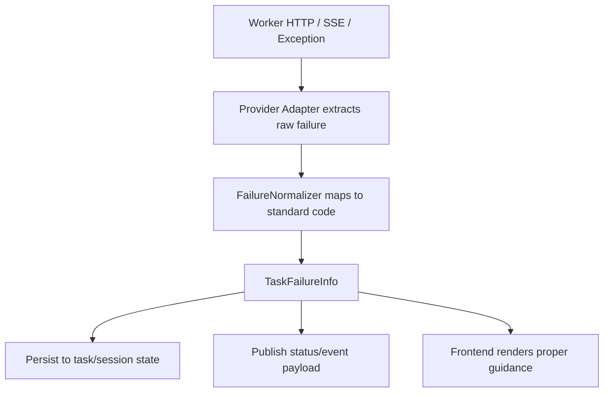

# 07 A2A Agent Failure Taxonomy And Refactor

## Date

- 2026-04-03

## Type

- Requirement
- Analysis
- Architecture

## Background

当前 A2A 链路已经基本承担了统一任务创建、查询、中止的主入口，但“失败”这件事仍然是分散的：

- Worker 侧按各自框架返回 HTTP 4xx/5xx、SSE `error` 事件或普通字符串
- Java Provider 层大多只保存 `errorMessage`
- `A2aAgent` SPI 没有结构化失败契约
- 前端最终只能消费“某条错误文案”，无法稳定区分认证失败、额度耗尽、超时、网络故障、可重试故障等

这会直接带来三个问题：

1. 同一类失败在 Claude / Codex 上表现不一致
2. 失败后的状态收敛、提示文案、重试策略无法统一
3. 后续接入新的 `A2aAgent` 时，会继续复制一套字符串匹配和临时判断逻辑

本需求用于单独讨论并收敛这块重构方向。

## Problem Statement

当前系统缺的不是“更多错误文案”，而是“平台级失败语义”。

尤其是下面这些业务上明显不同的失败，当前都容易被压平成普通字符串：

- 周限额已满
- 5 小时使用窗口已满
- API Key / Token 失效
- Worker Token 校验失败
- CLI 未安装
- 模型配置错误
- 网络超时 / SSE 中断
- Worker 进程异常退出
- 并发任务数超限
- 用户主动中止

如果这类失败不能在 A2A 层形成统一分类，平台后续很难稳定回答这些问题：

- 该失败是不是用户可修复
- 该失败是不是可重试
- 该失败要不要提示“重新认证 / 更换 Key / 稍后再试 / 联系管理员”
- 该失败要不要把任务标记为 `FAILED`，还是标记为 `ABORTED`
- 该失败是否需要前端进入特殊引导态

## Current Implementation Sync

### 1. `A2aAgent` SPI 只有动作，没有失败模型

当前 `navigator-spi/.../A2aAgent.java` 只定义：

- `sendTask(...)`
- `getTask(...)`
- `cancelTask(...)`

它没有：

- 失败码枚举
- 失败类别
- retryable 标志
- userAction / remediation 建议
- 结构化异常模型

这意味着 A2A 层现在只能靠：

- 抛异常
- 或在 `A2aTaskStatus.description` 里塞文本

来表达失败。

### 2. Claude / Codex Java Provider 当前都只持久化 `errorMessage`

当前这两条链路都没有平台级失败分类字段：

- `addons/claude-worker-agent/.../ClaudeTaskService.java`
- `addons/codex-worker-agent/.../CodexTaskService.java`

现状是：

- 任务失败后主要落库 `status=FAILED`
- 失败细节主要存放在 `errorMessage`
- `TaskStatusChangeEvent` 也主要只传 `errorMessage`

所以 session 层和前端层拿到的还是文案，不是结构化原因。

### 3. Claude Worker 已经能识别不少底层失败，但还没标准化

Claude 侧最丰富的失败提取在：

- `tools/claude-agent-worker/src/agent_worker/claude/sdk_wrapper.py`

当前已经能区分或间接识别：

- `ProcessError`
- `CLINotFoundError`
- `CLIJSONDecodeError`
- `CLIConnectionError`
- CLI 非零退出码
- heartbeat / hard-timeout warning
- permission timeout 场景

但这些最终仍主要落成字符串错误。

Claude HTTP / Worker 路由当前还能直接返回：

- 403 `Working directory ... is not in the allowed list`
- 429 `Maximum concurrent tasks ... reached`
- 404 permission request not found
- 400 permission request does not belong to this task
- 503 SDK is not installed
- 504 rewind timed out
- 500 rewind failed

对应代码主要在：

- `tools/claude-agent-worker/src/agent_worker/routes/query.py`
- `tools/claude-agent-worker/src/agent_worker/auth.py`

### 4. Codex Worker 也有失败点，但同样没有统一分类

Codex 侧当前主要失败出口包括：

- 400 请求校验失败
- 403 working directory not allowed
- 429 并发任务超限
- 401 缺失或非法 Authorization header
- 403 worker token invalid
- SSE 初始化失败
- Worker 运行时 `error` 事件

对应代码主要在：

- `tools/codex-agent-worker/src/routes/query.ts`
- `tools/codex-agent-worker/src/auth.ts`
- `tools/codex-agent-worker/src/codex/sdk-wrapper.ts`

Java 侧 `CodexStreamRelay` / `CodexTaskService` 最终同样主要保留字符串失败信息。

### 5. A2A 装饰层当前还没有承接统一失败语义

`session-module/.../ContextResolvingA2aAgent.java` 目前已经证明“装饰层”路线是成立的，但它当前只负责：

- 上下文解析
- 重复任务保护
- 会话 busy 判断
- prompt policy 适配

它还没有：

- 标准化失败归类
- 统一失败 envelope
- 失败后的状态 / 事件 / 文案收敛

## Failure Sources

从当前实现看，A2A 失败至少来自四层：

1. `User / Request Layer`
   - 参数非法
   - cwd 非法
   - permissionId 不匹配

2. `Auth / Quota Layer`
   - API Key 失效
   - Worker Token 失效
   - 供应商周限额已满
   - 5 小时窗口额度已满
   - 并发限流

3. `Worker / Runtime Layer`
   - CLI 未安装
   - CLI 进程异常退出
   - SDK 协议错误
   - SSE 中断
   - 连接失败
   - 超时

4. `Platform / Mapping Layer`
   - A2A Agent 解析失败
   - 远端 task id 解析失败
   - 任务归属校验失败
   - 本地状态已终态

## Target Taxonomy

建议不要继续用“每个 Provider 自己定义一堆文案”的方式，而是先收敛平台级失败分类。

### L1: Failure Domain

- `AUTH`
- `QUOTA`
- `REQUEST`
- `PERMISSION`
- `TIMEOUT`
- `CONNECTIVITY`
- `WORKER_RUNTIME`
- `PLATFORM`
- `USER_ACTION`
- `INTERNAL`

### L2: Failure Code

建议首批至少覆盖下面这些标准码：

| Code | Domain | Meaning |
|------|--------|---------|
| `AUTH_INVALID` | AUTH | Key / Token 无效 |
| `AUTH_EXPIRED` | AUTH | Key / 登录态过期 |
| `AUTH_MISSING` | AUTH | 缺失必要认证信息 |
| `QUOTA_WEEKLY_EXCEEDED` | QUOTA | 周额度已满 |
| `QUOTA_WINDOW_EXCEEDED` | QUOTA | 时间窗口额度已满，例如 5 小时额度 |
| `RATE_LIMITED` | QUOTA | 并发或速率限制 |
| `REQUEST_INVALID` | REQUEST | 参数非法 / 表单校验失败 |
| `WORKDIR_NOT_ALLOWED` | REQUEST | 工作目录不在白名单 |
| `PERMISSION_NOT_FOUND` | PERMISSION | permission request 已过期或不存在 |
| `PERMISSION_MISMATCH` | PERMISSION | permission request 不属于当前任务 |
| `TIMEOUT_SOFT` | TIMEOUT | 软超时，任务可能仍存活 |
| `TIMEOUT_HARD` | TIMEOUT | 硬超时，任务已视为失败或不可继续 |
| `SSE_DISCONNECTED` | CONNECTIVITY | SSE 流中断 |
| `WORKER_UNREACHABLE` | CONNECTIVITY | 无法连接 Worker |
| `CLI_NOT_INSTALLED` | WORKER_RUNTIME | CLI / SDK 未安装 |
| `CLI_PROCESS_FAILED` | WORKER_RUNTIME | CLI 非零退出 |
| `SDK_PROTOCOL_ERROR` | WORKER_RUNTIME | SDK / JSON 协议异常 |
| `REMOTE_TASK_NOT_FOUND` | PLATFORM | 远端任务不存在 |
| `REMOTE_TASK_ID_UNRESOLVED` | PLATFORM | 无法解析远端任务标识 |
| `A2A_AGENT_NOT_RESOLVED` | PLATFORM | 无法解析 A2A Agent |
| `TASK_ALREADY_TERMINAL` | PLATFORM | 任务已处于终态 |
| `USER_ABORTED` | USER_ACTION | 用户主动中止 |
| `INTERNAL_ERROR` | INTERNAL | 未分类内部异常 |

### L3: Failure Attributes

每个失败除了 code，还建议统一带这些属性：

- `retryable`
- `userAction`
- `userMessage`
- `providerMessage`
- `providerType`
- `httpStatus`
- `rawReason`
- `details`

其中：

- `userMessage` 给前端直接展示
- `providerMessage` 保留 Provider / Worker 原始语义
- `rawReason` 保留底层原始报错，便于排障
- `details` 放结构化上下文，例如 `limitWindow=5h`

## Recommended Failure Envelope

建议平台引入统一失败承载模型，例如：

```java
public record TaskFailureInfo(
        String code,
        String domain,
        boolean retryable,
        String userAction,
        String userMessage,
        String providerMessage,
        String providerType,
        Integer httpStatus,
        String rawReason,
        Map<String, Object> details
) {}
```

承载位置建议分两层：

1. 持久化层
   - `SessionTaskEntity.taskStateJson`
   - Provider task state json
   - 或新增独立 `failureJson`

2. A2A / API 输出层
   - `A2aTask.metadata.failure`
   - `DispatchTaskDTO.ext` 或等价结构

不建议只继续往 `errorMessage` 里拼接字符串。

## Suggested Normalization Flow



## Recommended Refactor Direction

### Decision Candidate 1: 失败标准化应放在 Java Provider / A2A 之间，而不是直接压给前端

前端不适合自己解析：

- HTTP 429 文案
- SDK Exception 字符串
- 不同 Worker 的 SSE `error`

建议做法是：

1. Worker 继续输出原始错误
2. Java Provider 先做第一轮提取
3. A2A 装饰层或共享标准化组件做统一映射
4. 前端只消费标准码和用户提示

### Decision Candidate 2: 保留 Provider 原始错误，但必须补平台标准码

这里不建议丢掉原始文案，因为：

- 排查问题仍需要它
- 某些供应商限制文案有具体时间窗口信息

建议统一为“双轨”：

- 标准字段：`code/domain/retryable/userAction`
- 原始字段：`providerMessage/rawReason/details`

### Decision Candidate 3: 周限额 / 5 小时额度这类应视为 `QUOTA`，不是普通 `AUTH`

这类错误和“Key 失效”不是一类问题，必须拆开。

原因：

- `AUTH_INVALID` 通常需要换 Key / 重新登录
- `QUOTA_WEEKLY_EXCEEDED` / `QUOTA_WINDOW_EXCEEDED` 通常需要等待窗口恢复或切换账号
- 它们的重试建议和前端引导完全不同

### Decision Candidate 4: timeout 要拆成“运行仍可能存活”和“已确认不可继续”

当前实现里已经存在这种差别：

- Claude 的 heartbeat / hard-timeout warning 更偏告警
- SSE 断线后任务可能仍在 Worker 上继续跑

所以不建议只有一个笼统 `TIMEOUT`。

建议至少区分：

- `TIMEOUT_SOFT`
  - UI 可提示“任务可能仍在运行，可重连 / 重同步”
- `TIMEOUT_HARD`
  - UI 可提示“任务已失败或需重新发起”

### Decision Candidate 5: `USER_ABORTED` 必须独立于 `FAILED`

用户主动取消本质上不是失败。

建议统一约束：

- 状态层仍保持 `ABORTED`
- 失败分类里不要把它混进 `FAILED`
- 事件 / UI 侧可以把它归为 `USER_ACTION`

这样后续统计、可观测性和用户体验都更清楚。

## Where To Place The Standardization

建议按下面分层：

### Worker Layer

职责：

- 保留原始失败信息
- 尽量提供可提取的结构上下文
- 不强依赖平台 DTO

可做但非强制：

- 返回 `error_code`
- 返回 `retryable`
- 返回 quota window 等 details

### Java Provider Layer

职责：

- 收集 HTTP / SSE / Exception 原始信息
- 做 Provider 内第一轮失败提取
- 输出统一 `TaskFailureInfo`

这一层最适合处理：

- Claude SDK 异常
- Codex Express / Worker 错误体
- HTTP status 到平台 code 的映射

### A2A Decorator Layer

职责：

- 统一平台级失败语义
- 统一任务状态收敛
- 统一事件输出字段
- 统一前端可消费的错误模型

这层最适合承接：

- `A2A_AGENT_NOT_RESOLVED`
- `REMOTE_TASK_ID_UNRESOLVED`
- `TASK_ALREADY_TERMINAL`
- user-facing guidance fallback

## Related Code Checklist

建议技术先从下面这些位置开始核对当前实现。

### SPI / Shared DTO

- `navigator-spi/src/main/java/com/foggy/navigator/spi/agent/A2aAgent.java`
- `navigator-common/src/main/java/com/foggy/navigator/common/dto/a2a/A2aTask.java`
- `navigator-common/src/main/java/com/foggy/navigator/common/dto/a2a/A2aTaskStatus.java`

### Session / A2A Decorator

- `session-module/src/main/java/com/foggy/navigator/session/agent/ContextResolvingA2aAgent.java`
- `session-module/src/main/java/com/foggy/navigator/session/service/TaskDispatchFacade.java`

### Claude Provider / Relay

- `addons/claude-worker-agent/src/main/java/com/foggy/navigator/claude/worker/service/ClaudeTaskService.java`
- `addons/claude-worker-agent/src/main/java/com/foggy/navigator/claude/worker/service/WorkerStreamRelay.java`
- `addons/claude-worker-agent/src/main/java/com/foggy/navigator/claude/worker/spi/ClaudeWorkerFacadeImpl.java`

### Codex Provider / Relay

- `addons/codex-worker-agent/src/main/java/com/foggy/navigator/codex/worker/service/CodexTaskService.java`
- `addons/codex-worker-agent/src/main/java/com/foggy/navigator/codex/worker/service/CodexStreamRelay.java`
- `addons/codex-worker-agent/src/main/java/com/foggy/navigator/codex/worker/spi/CodexWorkerFacadeImpl.java`

### Claude Worker

- `tools/claude-agent-worker/src/agent_worker/routes/query.py`
- `tools/claude-agent-worker/src/agent_worker/claude/sdk_wrapper.py`
- `tools/claude-agent-worker/src/agent_worker/auth.py`

### Codex Worker

- `tools/codex-agent-worker/src/routes/query.ts`
- `tools/codex-agent-worker/src/codex/sdk-wrapper.ts`
- `tools/codex-agent-worker/src/auth.ts`

### Frontend

- `packages/navigator-frontend/src/composables/useClaudeWorker.ts`
- `packages/navigator-frontend/src/composables/useTaskPane.ts`
- `packages/navigator-frontend/src/views/ClaudeWorkerView.vue`

## Suggested Analysis Checklist

下面这份清单不是强制拆解顺序，而是建议技术先从这些问题开始分析。

### 1. 先盘点现有失败来源

- Claude Worker 现有 HTTP / SSE / Exception 能产出哪些失败
- Codex Worker 现有 HTTP / SSE / Exception 能产出哪些失败
- 当前前端实际能看见哪些失败文案

### 2. 再确认哪些失败需要平台标准码

尤其优先覆盖：

- 认证失效
- 额度超限
- 并发限流
- Worker 不可达
- CLI 未安装
- 软超时 / 硬超时
- 用户主动中止

### 3. 再决定承载模型放在哪

- 继续只扩展 `errorMessage`
- 还是新增 `failureJson`
- 还是优先放入 `taskStateJson` / `A2aTask.metadata`

建议优先选可渐进兼容的方案，不要一上来大面积改接口。

### 4. 明确哪些错误必须 fail-fast

例如：

- `A2A_AGENT_NOT_RESOLVED`
- `REMOTE_TASK_ID_UNRESOLVED`
- `AUTH_INVALID`

这类不适合“吞掉后给一个模糊失败提示”。

### 5. 明确哪些错误允许继续保留原始 Worker 差异

例如：

- 供应商 quota 原始说明
- CLI stderr
- 上游 HTTP body

这些可以保留在 `providerMessage/rawReason/details`，不需要完全抹平。

## Acceptance Criteria

### Functional Acceptance

1. 平台必须能稳定区分至少以下失败：
   - 认证失败
   - 额度失败
   - 请求非法
   - 超时
   - Worker 连接失败
   - CLI / SDK 运行失败
   - 用户主动中止

2. Claude 与 Codex 对同类失败必须输出同一平台标准码。

3. `A2aTask` 或等价统一任务 DTO 必须能承载结构化失败信息，而不只是一条 `description/errorMessage`。

4. 用户主动取消必须继续落为 `ABORTED`，不能被归并成普通 `FAILED`。

5. `retryable` 与 `userAction` 必须对前端可见。

### Compatibility Acceptance

1. 现有 `errorMessage` 在兼容期内仍可保留，避免一次性打断旧前端或旧日志分析。

2. Worker 不要求一次性全部返回平台标准码；Java 层应支持先做兼容映射。

3. 旧任务记录即使没有结构化失败字段，也不能影响列表、详情和历史展示。

### Observability Acceptance

1. 日志中必须能区分：
   - 原始 Provider 错误
   - 标准化失败码
   - 是否可重试

2. 任务状态事件中必须能看到：
   - `failure.code`
   - `failure.retryable`
   - `failure.userAction`

3. 排障时必须还能回看原始 `providerMessage/rawReason`。

## Test Scope

### Unit Tests

1. 失败标准化组件
   - Claude 429 并发超限 -> `RATE_LIMITED`
   - Worker token invalid -> `AUTH_INVALID`
   - CLI not found -> `CLI_NOT_INSTALLED`
   - 周限额文案 -> `QUOTA_WEEKLY_EXCEEDED`
   - 5 小时窗口文案 -> `QUOTA_WINDOW_EXCEEDED`
   - SSE reconnect exhausted -> `SSE_DISCONNECTED` 或 `TIMEOUT_SOFT`

2. Java Provider
   - `ClaudeTaskService` / `CodexTaskService` 失败落库时保留结构化 failure
   - `TaskStatusChangeEvent` 携带标准化失败信息

3. A2A 装饰层
   - `A2A_AGENT_NOT_RESOLVED`
   - `REMOTE_TASK_ID_UNRESOLVED`
   - `TASK_ALREADY_TERMINAL`

### Integration / Regression Tests

1. Claude Worker 认证失败回归
2. Claude Worker 并发超限回归
3. Codex Worker token 失败回归
4. Codex Worker 请求校验失败回归
5. SSE 中断 / reconnect 失败回归
6. 用户取消任务回归，验证仍为 `ABORTED`

### Frontend / Playwright Validation

建议至少补一个 `playwright-cli` 最小验证矩阵：

1. 构造认证失败场景
   - 断言 UI 展示“重新认证 / 检查 Key”类提示

2. 构造额度失败场景
   - 断言 UI 展示“额度已满 / 稍后再试 / 切换账号”类提示

3. 构造请求非法场景
   - 断言 UI 展示可直接修正的输入提示

4. 构造用户中止场景
   - 断言最终状态为 `ABORTED`
   - 不展示为普通失败

如果当前环境难以稳定造出真实 quota 场景，可以先用 mock / stub worker 响应验证标准化链路。

## Delivery Assessment

这份文档可以直接交付技术，定位应是：

- “A2A 失败语义统一需求”
- 不是立即编码的详细设计稿
- 也不是只做调查的记录单

它已经具备：

- 当前实现同步
- 失败分类目标
- 推荐重构边界
- 关联代码清单
- 验收和测试建议

后续如果技术确认采用这条方向，建议再补一份更细的“字段落点 + 迁移顺序 + API 兼容策略”实施文档。

## Summary

`02` 关注的是某类流异常如何导致 session failure，它更偏“异常链路调查”。

本需求关注的是更上层的问题：平台应如何统一表达 A2A 失败。

建议后续重构的核心不是“继续扩展错误文案”，而是先把以下三件事定下来：

1. 平台标准失败码
2. 结构化 failure envelope
3. 标准化职责落在哪一层

只要这三件事先定住，Claude、Codex 以及后续新增的 `A2aAgent` 才有机会共享同一套失败处理语义。
