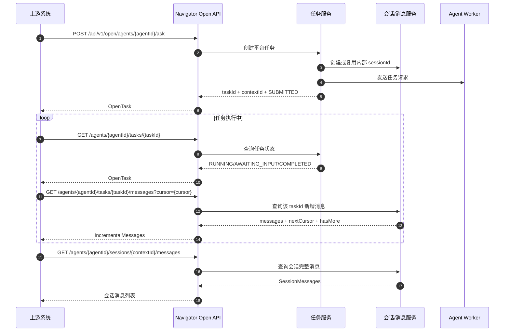
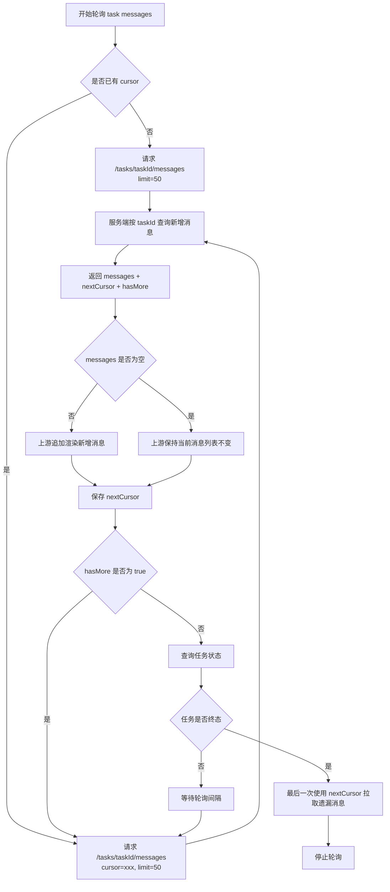
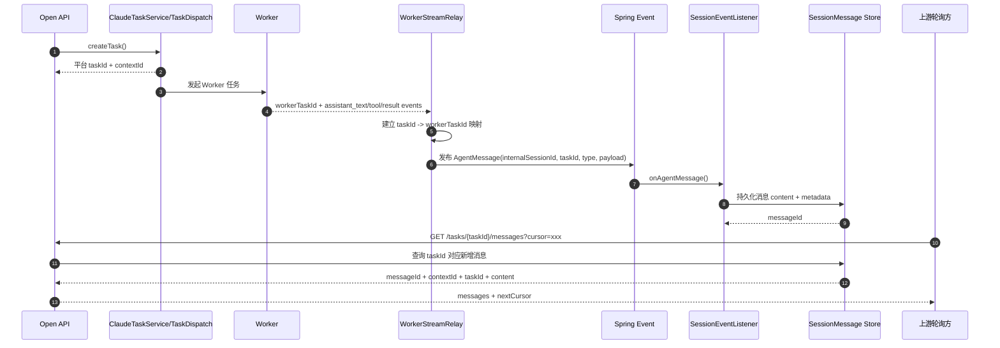
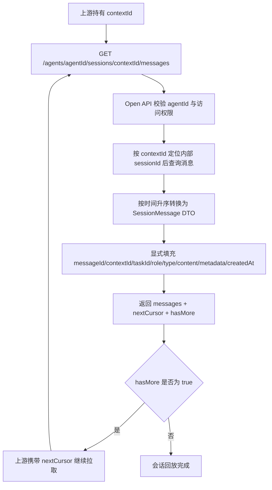
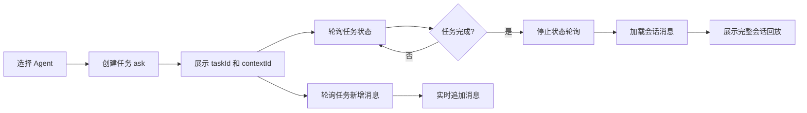

# 上游 Agent 接入时序图与流程图

## 文档作用

- doc_type: sequence-and-flow
- intended_for: external-integration-owner | execution-agent | reviewer
- purpose: 用 Mermaid 图说明 1.0.3-SNAPSHOT 上游接入首版的调用时序、增量消息轮询流程和平台内部 taskId 串联链路

## Version

- `1.0.3-SNAPSHOT`

## Status

- Draft
- 2026-04-15

## 上游输入文档

1. [01-upstream-agent-integration-requirement.md](./01-upstream-agent-integration-requirement.md)
2. [05-upstream-agent-integration-implementation-plan.md](./05-upstream-agent-integration-implementation-plan.md)
3. [06-upstream-agent-integration-api-contract-draft.md](./06-upstream-agent-integration-api-contract-draft.md)

## 1. 上游完整调用时序

该图说明上游系统如何完成首版完整接入：

1. 发起任务
2. 获取 `taskId/contextId`
3. 轮询任务状态
4. 轮询任务进行中的新增消息
5. 任务完成后回放会话消息

## 2. 增量消息轮询流程

该图说明上游如何使用 `cursor` 轮询进行中的消息。

首版语义建议：

- 第一次调用不传 `cursor`
- 服务端返回 `nextCursor`
- 后续调用携带上一次的 `nextCursor`
- 即使本轮没有新消息，也应返回当前任务标识和可继续使用的游标
- 任务终态后，上游可做最后一次消息轮询，再停止

## 3. 平台内部 taskId 串联时序

该图说明平台内部如何把同一任务内持续产生的多条消息串到同一个平台 `taskId` 下。

关键规则：

- 对上游暴露的平台主标识是 `taskId`
- Worker 内部任务 ID 只作为内部追踪或调试字段
- Worker 事件进入平台后，统一转换为带 `taskId` 的 AgentMessage
- 持久化消息时，必须能在对外 DTO 中显式返回 `taskId`

## 4. 会话回放流程

该图说明任务完成后，上游如何使用 `contextId` 回放会话消息。

## 5. Demo 推荐主流程

Demo 建议覆盖以下主流程：

## 6. 后续落地注意事项

实现阶段需要特别注意：

1. 图中的 `cursor` 语义需要在接口实现和 SDK 中保持一致
2. 图中的 `taskId` 必须是平台侧主标识
3. 图中的 `contextId` 必须是对外唯一会话主标识
4. 对外 DTO 不应要求上游理解 Worker 内部事件结构
5. 如果最终实现选择 `sinceMessageId` 而不是 `cursor`，需要同步更新本图和 API 合同草案
