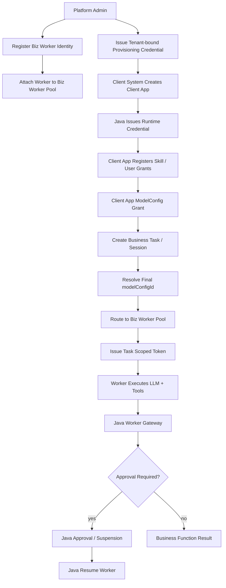

# Client App 接入、Worker 注册与运行时生命周期闭环

## 文档作用

- doc_type: lifecycle-design
- version: 1.1.3-SNAPSHOT
- status: draft
- date: 2026-05-03
- intended_for: platform-owner | upstream-business-owner | java-service-owner | worker-owner | skill-owner | execution-agent | reviewer
- purpose: 描述从 Biz Worker 注册、Client App 创建、Skill 与用户授权，到业务会话运行和 LLM 配置归属的端到端闭环

## 术语边界

- `Client App`：注册到 Navigator 的外部业务应用身份，绑定内部 `tenantId`，持有 runtime credential，并通过 grant 获得模型、Skill、函数和 Worker 路由权限。
- `upstream user`：Client App 内部的外部用户身份，不等同于 Navigator 内部用户。
- `upstream REST API`：外部业务系统提供的业务接口，不代表 Navigator 内部注册应用实体。
- `Biz Worker`：执行 LangGraph 业务 Agent 的 Worker 实例，不直接持有 Client App credential，不直接决定业务授权。

## 目标闭环

1. Java 控制面注册 Biz Worker identity。
2. Java 将 Worker identity 加入 Biz Worker Pool。
3. 平台管理员签发绑定内部 `tenantId` 的 provisioning credential。
4. 外部业务系统使用 provisioning credential 创建 Client App。
5. Java 为 Client App 签发 runtime credential。
6. Client App 维护或绑定 App 作用域 Skill。
7. Java 维护 Client App、Skill、upstream user、Business Function、LLM model config 的授权关系。
8. Client App 创建业务会话时，Java 解析并固定最终 `modelConfigId`，创建 task/session。
9. Java 选择 Biz Worker Pool 并签发 task scoped token。
10. Worker 通过内部 Worker Gateway 调用 Java 业务函数、上报 tool event、进入 approval/suspension、等待 Java resume。



## LLM 配置归属

当前普通会话的 LLM 配置可以作用在个人用户或内部 Agent 上，但 Client App 业务会话应把模型授权落在 Client App 上。

```text
Client App business session
  -> client_app_model_config_grant
  -> LlmModelConfigEntity
  -> LangGraph Biz Worker routing
```

设计规则：

1. 复用 `LlmModelConfigEntity`，不复制一份 App 私有模型配置。
2. 新增关系表 `client_app_model_config_grant` 维护 Client App 与模型配置的授权。
3. grant 创建时校验 `modelConfigId` 存在、属于同一 `tenantId`、`workerBackend` 可路由到 LangGraph Biz Worker。
4. 创建 task 时如果请求指定 `requestedModelConfigId`，必须在 enabled grant 中命中；不合法直接异常，不回退默认。
5. 未指定模型时使用 enabled default grant；没有默认模型直接异常。
6. task/session 必须保存最终 `modelConfigId`，resume 和继续会话不得漂移。

## 身份与凭证分层

| 凭证/身份 | 使用方 | 作用 | 约束 |
| --- | --- | --- | --- |
| provisioning credential | 外部业务系统初始化阶段 | 创建 Client App | 绑定 Navigator `tenantId`，不能用于运行时业务调用 |
| runtime credential | Client App | 创建业务 task/session、callback 认证 | 只代表一个 `client_app_id`，不能创建新 App |
| worker identity token | Biz Worker | Worker 注册和心跳 | 首版可简化为静态 token 或共享注册密钥 |
| task scoped token | Biz Worker | 调 Java Worker Gateway | 绑定 task/session/client_app/skill/worker_pool/授权快照和过期时间 |

## Java 与 Worker 边界

Java 负责：

1. Client App Registry、credential、tenant 绑定和状态管理。
2. ModelConfig Grant、Skill Grant、User Grant、Function Grant。
3. task/session 创建、最终 `modelConfigId` 固定和 Worker Pool 路由。
4. Worker Gateway 鉴权、函数授权、审计、幂等、approval/suspension。
5. 接收 Worker tool event，在需要审批时创建 approval 记录。

Worker 负责：

1. 调用 LLM。
2. 根据 Skill 描述选择工具。
3. 通过 Worker Gateway 调 Java 业务函数。
4. 在 LLM 触发 fsscript 工具时执行脚本侧能力。
5. 将 tool event、运行状态、approval wait 状态上报 Java。

fsscript 脚本由 LLM 调用 Worker 提供的工具触发，与 Java 调度无关。Java 只接收相关 tool message，并在需要审批时处理 approval/suspension。

## 首版明确不做

1. App Skill 审核流程。
2. 额度、计费和模型用量限制。
3. 完整 Worker identity token 轮换体系。
4. 角色技能 `role_skill`。
5. Worker 直接访问上游 REST 或持有 Client App secret。

## 待进入实施计划

1. Stage 1：Client App / credential / Worker Pool DB 与控制面。
2. Stage 2A：Client App LLM Policy 与 `client_app_model_config_grant`。
3. Stage 2B：business task/session skeleton 与 task scoped token。
4. Stage 3：Business Function Registry、Grant 与 Skill。
5. Stage 4：Worker Gateway 与 Approval/Suspension。
6. Stage 5：Python Worker 工具与 fsscript 事件上报。
7. Stage 6：端到端样例与验收闭环。
