# Client App 业务接入实现计划

## 文档作用

- doc_type: implementation-plan
- version: 1.1.3-SNAPSHOT
- status: draft
- date: 2026-05-03
- intended_for: java-service-owner | worker-owner | skill-owner | execution-agent | reviewer
- purpose: 将 Client App 接入、LLM model grant、Worker Gateway 与 Skill/Function 授权拆成可执行阶段，并记录当前重建状态

## 当前基线

已提交代码仍保留原有 `Langgraph*` 任务流与测试；此前 Stage 1 / Stage 2A 的 Client App 控制面代码曾以 untracked 文件存在，当前工作区已丢失，不能从 git 恢复。

本计划从当前 HEAD + 文档命名同步后的状态重新开始，直接使用 `ClientApp` 命名，不再经历旧注册应用命名的中间实现。

## 模块边界

Client App 是 Navigator 平台级业务接入身份，不属于某个具体 Worker addon。

建议新增公共业务模块 `business-agent-module`：

1. `business-agent-module` 负责 Client App、provisioning/runtime credential、model grant、后续 Skill/Function Registry、Worker Gateway 与 approval/suspension 控制面。
2. `addons/langgraph-biz-worker` 只负责 LangGraph Biz Worker 后端适配、Worker 通信、事件转换和执行链路。
3. `navigator-common` 继续作为基础 DTO/Entity/Enum/Repository 公共包，不承载这条业务域的 service/controller。
4. `agent-framework` 继续作为 Agent runtime 框架，不直接承载 Client App DB 控制面，避免框架层反向绑定业务接入模型。

## 命名基线

| 概念 | 统一命名 |
| --- | --- |
| 注册到 Navigator 的外部业务应用身份 | `Client App` |
| Java 字段 | `clientAppId` |
| API / JSON 字段 | `client_app_id` 或 `clientAppId`，按接口风格保持一致 |
| DB 表前缀 | `client_app` |
| LLM 授权关系表 | `client_app_model_config_grant` |
| App 私有 Skill | `client_app_skill` |
| 外部业务用户 | `upstream_user_id`，保留 upstream 命名 |
| 外部业务 REST / callback | `upstream REST API` / `upstream callback` |

## 总体阶段

```mermaid
flowchart LR
    S0[Stage 0 Baseline] --> S1[Stage 1 business-agent-module + Client App Control Plane]
    S1 --> S2A[Stage 2A App LLM Policy]
    S2A --> S2B[Stage 2B Task Skeleton + Scoped Token]
    S2B --> S3[Stage 3 Registry / Grant / Skill]
    S3 --> S4[Stage 4 Worker Gateway / Approval]
    S4 --> S5[Stage 5 Worker Tools / fsscript]
    S5 --> S6[Stage 6 E2E Sample]
    S6 --> S10A[Stage 10A navigator-open-sdk Business Agent API]
    S10A --> S10B[Stage 10B Upstream User Credential + REST Adapter Headers]
    S10B --> S10C[Stage 10C TMS Mock E2E + Safety Verification]
    S10C --> S10D[Stage 10D Upstream Auto Bootstrap Contract]
    S10D --> S10E[Stage 10E SDK Bearer Control Plane Auth]
    S10E --> S11[Stage 11 Business Task Worker Binding]
```



## Stage 0：代码基线确认

目标：确认当前可复用代码和新增代码边界。

执行项：

1. 保留 `LanggraphTaskEntity`、`LanggraphWorkerEntity`、`LanggraphApprovalEntity` 与现有 task service 测试。
2. 不改动已有 `LanggraphTaskService` 主链路，Client App 业务 task skeleton 后续独立落表或作为 projection 补充。
3. 确认新控制面不加入 `permitAll`，统一走现有 `@RequireAuth`。
4. 确认 docs 已统一为 `Client App` / `client_app_id`。

验收：

1. docs 中无注册应用身份旧命名残留，仅保留 `upstream_user_id`、`upstream REST API`、`upstream callback` 等外部系统视角命名。
2. `mvn test -pl addons/langgraph-biz-worker -am` 保持通过。

## Stage 1：`business-agent-module` 与 Client App DB 控制面

目标：建立 Client App、provisioning/runtime credential、Biz Worker identity、Biz Worker Pool 的 DB 与控制面。

执行项：

1. 新增 Maven module `business-agent-module`，依赖 `navigator-common`、`navigator-spi`，并提供 Spring Boot auto-configuration。
2. Launcher 依赖 `business-agent-module`；`addons/langgraph-biz-worker` 后续如需读取公共业务上下文，再依赖该模块。
3. 在 `business-agent-module` 新增 `ClientAppEntity` / `ClientAppRepository`。
4. 新增 `ClientAppProvisioningCredentialEntity` / Repository。
5. 新增 `ClientAppRuntimeCredentialEntity` / Repository。
6. 新增 `BizWorkerIdentityEntity` / Repository。
7. 新增 `BizWorkerPoolEntity`、`BizWorkerPoolMemberEntity` / Repository。
8. 新增 `ClientAppService`：
   - 创建 Client App 必须携带 provisioning credential。
   - provisioning credential 必须绑定当前内部 `tenantId`。
   - provisioning credential 已使用、过期、缺失或 tenant 不匹配时直接异常。
   - runtime credential 只能用于运行时，不能创建新 App。
9. 新增 `BizWorkerPoolService`：
   - 注册 Worker identity。
   - 创建 Worker Pool。
   - 维护 pool member。
   - pool disabled/unhealthy 时不得接新 task。
10. 新增控制面 Controller：
   - `ClientAppController`：`/api/v1/client-apps`，要求 `TENANT_ADMIN`。
   - `AdminClientAppController`：`/api/v1/admin/client-apps/provisioning-credentials`，要求 `TENANT_ADMIN`。
   - `BizWorkerPoolController`：Worker identity 注册要求 `SUPER_ADMIN`，pool 控制面要求 `TENANT_ADMIN`。
11. `BizWorkerPoolMemberEntity` 必须唯一约束 `(poolId, workerId)`。
12. 补 DTO/Form 和 service 单元测试。

验收：

1. Client App disabled/suspended 时不能创建业务 task。
2. runtime credential 不能创建新 App。
3. Worker Pool disabled/unhealthy 时不能接新 task。
4. 控制面角色测试覆盖 `TENANT_ADMIN` / `SUPER_ADMIN`。
5. `mvn test -pl business-agent-module -am` 与 `mvn test -pl addons/langgraph-biz-worker -am` 通过。

## Stage 2A：Client App LLM Policy 与 `client_app_model_config_grant`

目标：让 Client App 创建业务会话时能解析并固定最终 `modelConfigId`。

执行项：

1. 新增 `ClientAppModelConfigGrantEntity` / Repository / Service。
2. 复用 `LlmModelConfigEntity`，通过 `LlmModelManager.getModelConfig` 校验 `modelConfigId` 存在。
3. 校验 model config 属于同一 `tenantId`。
4. 校验 `workerBackend` 必须为 `LANGGRAPH_BIZ`，不合法直接异常。
5. 提供绑定默认模型配置、启停授权、查询 App 可用模型配置 API：
   - `GET /api/v1/client-apps/{clientAppId}/model-config-grants`
   - `POST /api/v1/client-apps/{clientAppId}/model-config-grants`
   - `PUT /api/v1/client-apps/{clientAppId}/model-config-grants/{grantId}/status`
   - `PUT /api/v1/client-apps/{clientAppId}/model-config-grants/{grantId}/default`
6. 同一 Client App 不能重复授权同一 `modelConfigId`。
7. 默认模型唯一性由 service 清理保证；并发造成多默认时，运行时解析不得因非唯一结果熔断，应 fail-closed 或确定性处理并记录风险。
8. `resolveEffectiveModelConfigId` 规则：
   - `requestedModelConfigId` 非空时，必须命中 enabled grant，不合法直接异常，不回退默认。
   - 未指定时，必须存在 enabled default grant，否则直接异常。
   - 返回前二次校验 model config 仍存在、同 tenant、backend 合法。
9. 补单元测试覆盖 null form、backend 不匹配、跨 tenant、重复 grant、默认解析、禁用默认、脏授权拒绝。

验收：

1. 未绑定 enabled default model config 的 Client App 不能创建 task。
2. requested config 不在 grant 内时返回业务异常。
3. requested config 的 worker backend 不匹配时返回业务异常。
4. 同一 Client App 不能存在两个有效 default grant 造成运行时非唯一异常。
5. `mvn test -pl business-agent-module -am` 与 `mvn test -pl addons/langgraph-biz-worker -am` 通过。

## Stage 2B：Business Task Skeleton 与 Task Scoped Token

目标：建立 Java 侧业务 task/session skeleton，为 Worker Gateway 提供可信上下文。

执行项：

1. 新增 business task/session skeleton，至少保存：
   - `taskId`
   - `sessionId`
   - `tenantId`
   - `clientAppId`
   - `upstreamUserId`
   - `navigatorEffectiveUserId`
   - `skillId`
   - `workerPoolId`
   - 最终 `modelConfigId`
   - 状态与创建时间
2. 创建业务 task 时调用 `ClientAppModelConfigGrantService.resolveEffectiveModelConfigId`。
3. 生成 task scoped token 或签发快照，绑定 task/session/client_app/skill/worker_pool/model grant snapshot/过期时间。
4. session/task 记录固定最终 `modelConfigId`，resume 与继续会话不得漂移。

验收：

1. 创建 task 时 Java 固定 `modelConfigId`。
2. task scoped token 可供 Stage 4 Gateway 鉴权测试使用。
3. task/session 与 Client App、upstream user、Skill、Worker Pool 的绑定可审计。

## Stage 3：Business Function Registry、Grant 与 Skill

目标：Java 能以 Registry/Grant 判断某个 Client App、Skill、upstream user 是否能调用某个业务函数。

执行项：

1. 新增 Business Function 与 Function Version 存储，Registry 首版直接走 DB；如 JPA 描述复杂，可用 Mongo。
2. 支持导入或创建 Function Manifest。
3. 新增 Client App Function Grant。
4. 新增 Skill 与 Function allowlist 关系。
5. 新增 upstream user grant 或 user group grant。
6. App Skill 首版不需要审核。

验收：

1. App/Skill/User/Function 任一授权不满足时，业务函数不能执行。
2. Worker 只能看到当前 task 可见函数摘要。

## Stage 4：Worker Gateway 与 Approval/Suspension

目标：Worker 只能通过 Java Gateway 调业务函数和上报工具事件。为实现平滑过渡，将此阶段拆分为 4A、4B、4C。

### Stage 4A：Worker Gateway Auth + list/schema 最小闭环 [COMPLETED]
- 新增 `/internal/worker-gateway/v1/business-functions` 和 schema 查询。
- 校验 `X-Task-Scoped-Token` 解析 task/clientApp/upstreamUser/skill 上下文。
- 严密收敛：仅通过内部鉴权 `BusinessFunctionAuthorizationService` 放行可见函数。
- DTO 清洗：屏蔽 `adapterConfigJson` 和 `manifestJson`。
- 注：暂不要求复杂的 Worker Identity 校验，强依赖 task-scoped token；延后 run/resume。

### Stage 4B：invoke skeleton + approval placeholder [COMPLETED]
- 实现 `invoke_business_function`，但不真实调用上游 REST adapter 也不执行 fsscript。
- `approvalRequired=true` 返回 `suspended` 伪造响应，并生成 suspendId 占位。
- `approvalRequired=false` 返回 `adapter/not-implemented` 明确表示授权通过但执行器未接入。
- 注：已完成 invoke 的授权闭环，任一授权不合法抛异常不降级，但暂不触发真正的业务逻辑。

### Stage 4C：approval/suspension lifecycle [ACCEPTED-WITH-RISKS]
- 实现 suspension entity 与 approval 状态流转。
- 提供 resume endpoint，并对接 LangGraph Biz Worker 审批流。
- 验收记录详见：[stage-4c-gateway-suspension-lifecycle-acceptance.md](acceptance/stage-4c-gateway-suspension-lifecycle-acceptance.md)

### Stage 4D：Gateway suspension hardening [COMPLETED]
- 将 resume 文档入口统一为 Control Plane endpoint：`POST /api/v1/business-agent/suspensions/{suspendId}/resume`。
- `WorkerGatewayService.invokeBusinessFunction` 对结构化 `input` 序列化失败执行 fail-closed。
- `BusinessFunctionSuspensionService.resumeSuspension` 显式拒绝 null form。
- 验收记录详见：[stage-4d-gateway-suspension-hardening-acceptance.md](acceptance/stage-4d-gateway-suspension-hardening-acceptance.md)

验收：

1. Worker 不能伪造 `client_app_id`、`upstream_user_id`、`worker_pool_id`。
2. 高风险函数未审批不能执行副作用。
3. 真实 Worker 调用能获取正确过滤的函数 schema 列表。能接收 fsscript 相关 tool message，并在需要审批时处理。

## Stage 5：Worker Tools / fsscript [COMPLETED]

目标：在 `langgraph-biz-worker` 中提供 LLM 可调用工具，通过 Java Worker Gateway 完成受控业务函数调用和事件上报。

### 已实现

1. **WorkerGatewayClient**：HTTP 客户端，封装对 Java Worker Gateway 内部 API 的调用（`/internal/worker-gateway/v1/**`），所有调用携带 `X-Task-Scoped-Token`，token 缺失或 HTTP 错误时 fail-closed。
2. **LLM 工具**（实现 `BuiltInTool` 接口，通过 `@Component` 注册）：
   - `list_business_functions`：查询当前 task 范围内可见的函数摘要
   - `get_business_function_schema`：获取函数 schema、风险等级和审批信息
   - `invoke_business_function`：调用函数；处理 SUSPENDED（记录 suspendId / approval_wait）和 SUCCESS 状态；unsupported adapter fail-closed
   - `run_business_script`：**占位工具**，返回 `SCRIPT_RUNTIME_NOT_AVAILABLE` 状态；调用 `reportToolMessageSafely` 上报 Java（best-effort）
3. **Java 侧 Tool Message 上报端点**：`POST /internal/worker-gateway/v1/tool-messages`，验证 task-scoped token 后记录审计日志，本阶段不持久化到 DB。
4. 所有工具调用失败时返回结构化错误，不会降级或绕过 Gateway。
5. 验收记录详见：[stage-5-worker-tools-fsscript-acceptance.md](acceptance/stage-5-worker-tools-fsscript-acceptance.md)。

### 限制

- 真实 REST adapter 不在本阶段；Stage 8A 已接入 Local Echo adapter，非审批 echo 调用返回 `SUCCESS`，unsupported adapter fail-closed。
- fsscript runtime 未接入，`run_business_script` 为占位工具。
- Tool message 目前仅记录审计日志，未持久化到数据库。

验收：

1. fsscript 与 Java 调度解耦（占位工具不调用 Java 执行脚本，但会上报 SCRIPT_NOT_AVAILABLE 事件）。
2. Java 能收到 tool message 并按风险进入审批。
3. Worker 所有 Gateway 调用均通过 HTTP 客户端，不直接访问 Function Registry。

## Stage 6：端到端样例与验收闭环

目标：以一个 Client App 样例跑通创建 App、授权模型、注册 Skill、创建会话、调用函数、审批、resume。

验收：

1. 从 provisioning credential 到 runtime credential 的生命周期可追踪。
2. 从 Client App 到 Skill/Function/Model Grant 的授权链可追踪。
3. Worker Gateway 调用和 approval/suspension 有测试证据。
4. 文档、测试、实现状态一致。

**实现记录（2026-05-03）**：新增 `BusinessAgentE2ESampleTest`，包含 6 个测试用例（1 个完整生命周期 + 5 个负例）。
所有测试通过；验收结论为 `accepted-with-risks`，记录详见：[stage-6-e2e-sample-acceptance.md](acceptance/stage-6-e2e-sample-acceptance.md)。

## Stage 10：TMS Business Agent SDK 与上游用户凭据注入

目标：让 TMS 这类外部业务系统可以通过 SDK 完成 Business Agent 控制面初始化，并在运行时由 Navigator 服务端受控注入上游用户凭据和调用上下文 header。

详细计划见：[upstream-integration/12-tms-business-agent-sdk-and-token-injection-plan.md](upstream-integration/12-tms-business-agent-sdk-and-token-injection-plan.md)

### Stage 10A：navigator-open-sdk Business Agent Control Plane API [ACCEPTED-WITH-RISKS]

- 新增 `client.businessAgent()` SDK 聚合入口。
- 封装 ClientApp、Credential、Model Grant、Skill/User/Function Grant、BusinessObject、BusinessFunction、Task、Approval Resume。
- 明确 SDK 控制面鉴权模式。
- 本阶段不实现 TMS 用户 token 存储，也不修改 REST Adapter header 注入。
- 验收结论（2026-05-04）：`accepted-with-risks`。SDK 已兼容 `RX<T>` 与裸 JSON 响应，Form/DTO 已与后端契约对齐；风险为 smoke test 尚未覆盖全部 wrapper。

### Stage 10B：Upstream User Credential + REST Adapter Header Injection [COMPLETED]

- 在 `ClientAppUpstreamUserGrantEntity` 上保存 grant-bound upstream user token，维度为 `tenantId + clientAppId + upstreamUserId`。
- REST Adapter 根据 task 上下文解析 `tenantId + clientAppId + upstreamUserId` 对应凭据。
- 服务端注入用户 token header 与 Navigator 上下文 header。
- token 不进入 LLM、Manifest、前端 DTO、日志、audit output。
- 验收记录：[stage-10b-upstream-user-credential-and-rest-header-injection-acceptance.md](acceptance/stage-10b-upstream-user-credential-and-rest-header-injection-acceptance.md)

### Stage 10C：TMS Mock E2E + LLM-Facing Safety Verification [COMPLETED]

- 使用 TMS mock 服务验证 SDK 初始化、函数注册、task 创建、REST Adapter 调用。
- LLM-facing 运单字段统一验证为 `orderIdentifier`。
- 验证 `expressOrderId` 不进入 BusinessFunction input schema、tool schema、前端可填参数。
- 补充 upstream integration 文档与敏感字段检查证据。
- 验收记录：[stage-10c-tms-mock-e2e-and-safety-acceptance.md](acceptance/stage-10c-tms-mock-e2e-and-safety-acceptance.md)

### Stage 10D：Upstream Auto Bootstrap Contract [COMPLETED]

- 将上游真实联调从手工提示词操作收敛为 manifest + env + SDK bootstrap runner。
- 明确上游自动化 runner 可创建/复用 ClientApp、BusinessObject、Function、Skill、Grant 与 BusinessAgentTask。
- 明确 Worker Gateway 仍是 Navigator 内部 API，上游 runner 不直接调用。
- 更新 personal `navigator-upstream-llm-integration` skill，提供 TMS auto bootstrap runbook、manifest template 与 env template。
- 验收记录：[stage-10d-upstream-auto-bootstrap-contract-acceptance.md](acceptance/stage-10d-upstream-auto-bootstrap-contract-acceptance.md)

### Stage 10E：SDK Bearer Control Plane Auth [COMPLETED]

- `NavigatorClient.Builder` 新增 `bearerToken(...)` 与 `adminToken(...)`，用于当前登录态/admin JWT。
- `apiKey("sk-*")` 继续发送 `X-API-Key`；`adminToken(jwt)` 发送 `Authorization: Bearer <jwt>`。
- 明确禁止把 JWT 复用为 `apiKey(...)`，避免控制面 bootstrap 在首个 SDK 调用处 401。
- 更新 upstream integration 文档与 personal skill 的 TMS bootstrap runbook。
- 验收记录：[stage-10e-sdk-bearer-control-plane-auth-acceptance.md](acceptance/stage-10e-sdk-bearer-control-plane-auth-acceptance.md)

## Stage 11：Business Task 与 Worker Task 运行时绑定 [ACCEPTED-WITH-RUNTIME-RETEST]

目标：修复 TMS P1 approval-required 真实 invoke 验证中发现的 Navigator 内部绑定缺口。Business Agent 创建 `bt_*` task 后，需要同步创建并绑定真实 LangGraph `lgt_*` task；审批 resume 时必须投递到 `lgt_*`，同时 runtime token 也必须能按 `lgt_*` 精确解析。

已实现：

1. `business-agent-module` 新增 `BusinessAgentWorkerTaskLauncher` SPI。
2. `addons/langgraph-biz-worker` 新增 `LanggraphBusinessAgentWorkerTaskLauncher`，按 Worker Pool 选择 enabled worker member，并通过 `LanggraphTaskService` 创建真实 LangGraph task。
3. `BusinessAgentTaskEntity` / `BusinessTaskScopedTokenEntity` / `BusinessFunctionSuspensionEntity` 增加 worker task binding 字段。
4. `BusinessAgentTaskService.createTask` 保存 `workerTaskId`、`workerId`、`workerProviderType`，并将 task scoped token 同时注册到 `bt_*` 与 `lgt_*`。
5. `BusinessFunctionSuspensionService.resumeSuspension` 在存在 `workerTaskId` 时向 `lgt_*` 分发 resume event，旧记录继续 fallback 到 `bt_*`。
6. 新增单元测试覆盖 worker task 创建、token alias、suspension 绑定和 resume event 分发。

验收记录：[stage-11-business-task-worker-binding-acceptance.md](acceptance/stage-11-business-task-worker-binding-acceptance.md)

限制：已有旧 task / suspension 不会自动补齐 `workerTaskId`。真实 P1 approval invoke 需要重启 Navigator 后重新创建 Business Agent task 再验收。

## 当前进度

| Stage | 状态 | 备注 |
| --- | --- | --- |
| Stage 0 代码基线确认 | completed | docs 已同步 Client App 命名；LangGraph 既有测试通过 |
| Stage 1 Client App DB 基础 | completed | 已在 `business-agent-module` 重建，未落入 LangGraph addon |
| Stage 2A App LLM Policy | completed | 已在 `business-agent-module` 以 `ClientApp*` 重建 |
| Stage 2B Task Skeleton | completed | 已建立 `business-agent-module` 的 Task / Token 控制面与服务 |
| Stage 3A Business Function Registry 与 Client App Function Grant | completed | 已建立 Function Registry DB，支持导入 Manifest 和给 App 授权 |
| Stage 3B Skill、Function allowlist 与 upstream user grant | completed | BusinessObject + Skill/User/Function 组合授权闭环完成 |
| Stage 4 Worker Gateway / Approval | completed | 4A/4B/4C/4D 已完成；4C accepted-with-risks，4D 已完成硬化收尾 |
| Stage 5 Worker Tools / fsscript | completed | 4 个 LLM 工具 + WorkerGatewayClient + tool-message 上报端点；`run_business_script` 占位并上报 Java |
| Stage 6 E2E Sample | completed | accepted-with-risks；BusinessAgentE2ESampleTest: 6 tests (full lifecycle + 5 negative); 2026-05-03 |
| Stage 7A Runtime Task Token Injection | completed | Tool schemas cleaned and `TaskScopedTokenResolver` reads from `runtimeContext` only. Production execution path now injects `runtimeContext.task_scoped_token` via `ToolRuntimeContextProvider` and `BusinessAgentTaskScopedTokenRuntimeStore`; accepted-with-risks; 2026-05-03 |
| Stage 7B Resume Event Listener Binding Hardening | completed | Tenant validation added to `LanggraphWorkerResumeEventListener`; fail-closed on mismatch/absent; 2026-05-03 |
| Stage 7C Runtime Token Hardening | completed | TTL aligned with DB, tenantId fallback removed, exact task lookup is fail-closed; 2026-05-03 |
| Stage 7D TaskId Propagation | completed | Propagate `Message.taskId` from invocation into ToolRuntimeContextRequest; 2026-05-03 |
| Stage 8A Business Function Adapter Invocation Minimal Loop | completed | Local Echo adapter implemented for non-approval functions. Unsupported configs fail-closed. No exposed config in Worker DTOs; 2026-05-03 |
| Stage 8B Outbound REST Adapter Minimal Secure Loop | completed | RestBusinessFunctionAdapterInvoker implemented with property-based SSRF protection, URL/path/method/header hardening, non-2xx fail-closed, and JSON path evaluation; 2026-05-04 |
| Stage 9 Persistent Audit + Upstream E2E | completed | BusinessFunctionRuntimeAuditEntity/Service; best-effort audit writes for invoke/tool-message/resume lifecycle; RestAdapterUpstreamE2ETest with real local HTTP server; 2026-05-04 |
| Stage 9B Upstream Integration Guide | completed | SDK/component-first upstream onboarding docs added under `upstream-integration/` (00-overview ～ 10-demo-checklist); README and implementation plan linked; 2026-05-04 |
| Stage 9C LLM SDK Guide + Personal Skill | completed | Added LLM-facing SDK usage guide and created personal `navigator-upstream-llm-integration` skill for upstream LLM coding agents; 2026-05-04 |
| Stage 10A navigator-open-sdk Business Agent API | completed | accepted-with-risks; SDK control-plane wrappers; Auth uses existing X-API-Key which resolves TENANT_ADMIN context; no TMS token storage yet; 2026-05-04 |
| Stage 10B Upstream User Credential + REST Adapter Headers | completed | Grant-bound upstream user token storage; REST adapter controlled user-token and Navigator context header injection; 2026-05-04 |
| Stage 10C TMS Mock E2E + Safety Verification | completed | SDK onboarding smoke, TMS mock REST E2E, `orderIdentifier` schema guard, sensitive-field checks; 2026-05-04 |
| Stage 10D Upstream Auto Bootstrap Contract | completed | manifest + env + SDK runner 契约；personal skill 增加 TMS auto bootstrap runbook 与模板；2026-05-05 |
| Stage 10E SDK Bearer Control Plane Auth | completed | `NavigatorClient.adminToken/bearerToken` 支持 Bearer 控制面鉴权；当前 sandbox JWT 不再误走 `X-API-Key`; 2026-05-05 |
| Stage 11 Business Task Worker Binding | completed | `bt_*` 创建时绑定真实 `lgt_*`；resume event 投递到 worker task；runtime token 注册 worker task alias；TMS P1 approval invoke 已重启后复测通过，Gateway=`SUCCESS`、TMS code=`200`、data=yes、leak=false；2026-05-06 |

> [!NOTE]
> `BusinessObject` 是用于组织函数（Function）的业务对象概念，不是授权主体。授权主体仍然由 ClientApp / upstreamUser / Skill / Function grant 进行细粒度控制。
> 注册对象后，可以在函数 manifest import 时传 businessObjectId；如果 BusinessObject 状态为 disabled，则不允许继续挂载新的函数版本。

## 已实现记录

2026-05-03：

1. 新增 `business-agent-module`，并加入根 `pom.xml` 与 `launcher` 依赖。
2. 新增公共控制面 auto-configuration：`BusinessAgentAutoConfiguration`。
3. 新增 Client App、provisioning/runtime credential、Biz Worker identity/pool/member、Client App model config grant 的 Entity/Repository/DTO/Form/Service/Controller。
4. Client App 创建必须使用 tenant-bound provisioning credential；runtime credential 不参与创建 App。
5. Model grant 复用现有 `LlmModelManager`，强制同 tenant、`workerBackend=LANGGRAPH_BIZ`，解析时 fail-closed。
6. 控制面角色：
   - Client App 与 model grant：`TENANT_ADMIN`
   - provisioning credential 管理：`TENANT_ADMIN`
   - Worker identity 注册：`SUPER_ADMIN`
   - Worker Pool 管理：`TENANT_ADMIN`
7. (Stage 2B) 新增 `BusinessAgentTaskEntity`、`BusinessTaskScopedTokenEntity` 及其 Repository。
8. (Stage 2B) 新增 `BusinessAgentTaskService` 与 `BusinessAgentTaskController`，负责任务与令牌生成，并在创建时执行最终 `modelConfigId` 决议，后续不漂移。
9. (Stage 2B) 新增测试：
   - `BusinessAgentTaskServiceTest`：全面覆盖模型漂移拦截、重用检查与成功场景
   - `BizWorkerControlPlaneAuthorizationTest` 追加 `BusinessAgentTaskController` 方法权限检查
10. (Stage 3A) 新增 `BusinessFunctionEntity`、`BusinessFunctionVersionEntity`、`ClientAppFunctionGrantEntity` 及相应的 Repository。
11. (Stage 3A) 新增 `BusinessFunctionRegistryService` 及 `BusinessFunctionRegistryController`，提供业务函数导入、授权、可见性查询以及运行时 fail-closed 函数解析。
12. (Stage 3A) 新增测试：
    - `BusinessFunctionRegistryServiceTest` 覆盖 import 冲突、授权校验、fail-closed context 解析以及 DTO LLM/Worker 字段可见性过滤。
    - `BizWorkerControlPlaneAuthorizationTest` 追加 `BusinessFunctionRegistryController` 控制面权限测试。

测试证据：

```bash
mvn test -pl business-agent-module -am
# Tests run: 34, Failures: 0, Errors: 0, Skipped: 0
# BUILD SUCCESS

mvn test -pl addons/langgraph-biz-worker -am
# LangGraph Biz Worker: Tests run: 24, Failures: 0, Errors: 0, Skipped: 0
# Reactor upstream modules: Tests run: 198, Failures: 0, Errors: 0, Skipped: 0
# BUILD SUCCESS

mvn compile -pl launcher -am -DskipTests
# BUILD SUCCESS
```

**(Stage 7A/7B) 2026-05-03：**

- `ToolExecutionRequest` 新增 `runtimeContext` 字段（不暴露给 LLM）。
- 新增 `TaskScopedTokenResolver` 工具类（`addons/langgraph-biz-worker`），通过 `runtimeContext` 解析 token，不读 `parameters`。
- 4 个 Worker 工具（`ListBusinessFunctionsTool`、`GetBusinessFunctionSchemaTool`、`InvokeBusinessFunctionTool`、`RunBusinessScriptTool`）重写：
  - `getParameters()` 不再包含 `task_scoped_token` 属性。
  - `execute()` 只从 `runtimeContext` 读取 token；`parameters` 中的 token 被忽略。
  - 缺失 runtime token → `MISSING_TOKEN` fail-closed。
- `LanggraphWorkerResumeEventListener` 增加 tenant 绑定校验：
  - event tenantId 存在且 task tenantId 缺失 → fail-closed。
  - tenantId 不一致 → fail-closed。
  - event 无 tenantId → 向后兼容（debug log，未来可升级为 fail-closed）。
- 新增/更新测试证据：

```bash
mvn test -pl agent-framework -am
# Tests run: 208, Failures: 0, Errors: 0

mvn test -pl addons/langgraph-biz-worker
# Tests run: 62, Failures: 0, Errors: 0

mvn test -pl business-agent-module
# Tests run: 125, Failures: 0, Errors: 0

mvn compile -pl launcher -am -DskipTests
# BUILD SUCCESS
```

验收记录：[stage-7-runtime-token-and-resume-hardening-acceptance.md](acceptance/stage-7-runtime-token-and-resume-hardening-acceptance.md)

验收结论：Stage 7B 已满足；Stage 7A 已满足；Stage 7C 已满足；Stage 7D 已补齐 `DefaultAgentInvoker` 的可靠业务 `taskId` 传播。7C 已处理 TTL 对齐、缺失 tenantId 不再降级到 userId、以及 taskId 非空时 exact miss 必须 fail-closed 的问题；7D 将 `Message.taskId` 传入 `ToolRuntimeContextRequest.taskId`，生产路径可使用精确 task 绑定。session 级 fallback 仅保留给调用方未提供 `Message.taskId` 的兼容路径。

## 后续执行要求

1. 每个阶段完成后必须更新本表状态和测试证据。
2. 代码实现先 commit 再做大范围批量替换。
3. 新增核心领域命名必须按 `plan-evaluator` 的 `naming-and-terminology-review.md` 检查。
4. 每次实现后至少运行公共模块测试；涉及 LangGraph 适配时同时运行 `mvn test -pl addons/langgraph-biz-worker -am`。
