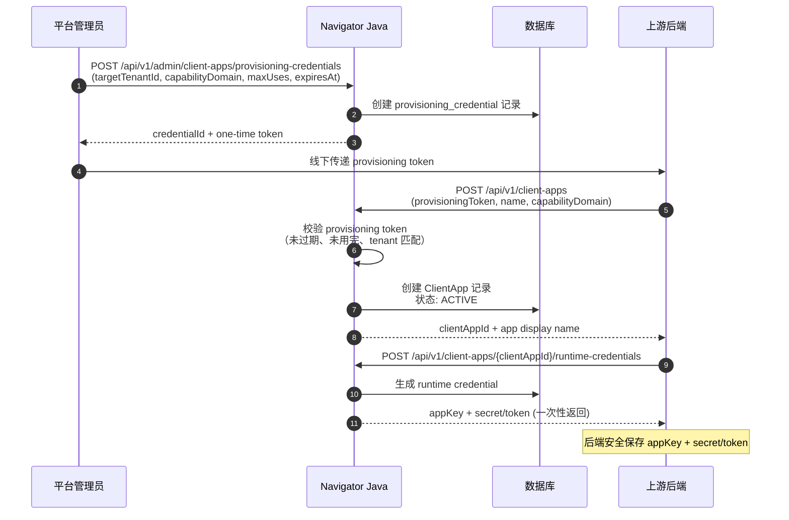

# 创建 Client Application

## 文档作用

- doc_type: integration-guide
- version: 1.1.3-SNAPSHOT
- status: draft
- date: 2026-05-04
- intended_for: platform-admin | upstream-backend-developer
- purpose: 说明如何创建 Client Application、绑定 tenant、获取凭证以及完成初始化

## 概念

**Client Application**（内部代码名 `ClientApp`）是上游业务系统在 Navigator 中的注册身份。它：

- 绑定一个内部 `tenantId`
- 持有 runtime credential 用于运行时调用
- 通过 grant 获得 Skill、Business Function、LLM model config 和 Worker routing 的使用权限
- 是授权、审计、路由和 callback 的最小隔离单元

> **收敛规则**：上游的一个租户 = 一个 Client Application。Navigator 不透传上游多租户层级。

## 凭证分层

| 凭证 | 使用方 | 用途 | 约束 |
| --- | --- | --- | --- |
| **Provisioning Credential** | 平台管理员签发 → 上游后端使用 | 创建 Client Application | 绑定 `tenantId`、限制可创建数量、设置过期时间；**不能**用于运行时调用 |
| **Runtime Credential** | Java 签发 → 上游后端保存 | 创建任务、callback 认证、运行时交互 | 只代表一个 `clientAppId`；**不能**创建新 App |

> **⚠️ Secret 安全**：任何凭证（provisioning code、runtime app_key/app_secret）都只能由**上游后端**保存。前端不得持有。

## 创建流程



## 步骤详解

### Step 1：平台管理员签发 Provisioning Credential

```text
POST /api/v1/admin/client-apps/provisioning-credentials
```

需要 `TENANT_ADMIN` 权限。

请求体示例字段：

```yaml
targetTenantId: nav-tenant-a
ownerUserId: upstream-provider-a
capabilityDomain: order
maxUses: 10
expiresAt: 2026-06-01T00:00:00+08:00
auditTag: upstream-provider-a-bootstrap
```

### Step 2：上游后端使用 Provisioning Code 创建 App

```text
POST /api/v1/client-apps
```

需要 `TENANT_ADMIN` 权限。

- 必须携带有效的 `provisioningToken`
- Code 必须绑定当前请求的 `tenantId`
- Code 已使用、过期或 tenant 不匹配时直接异常

请求体示例字段：

```yaml
provisioningToken: pct_xxx
name: Order Assistant
description: Order domain business agent integration
ownerUserId: upstream-admin-001
capabilityDomain: order
```

### Step 3：签发 Runtime Credential

```text
POST /api/v1/client-apps/{clientAppId}/runtime-credentials
```

- 返回 `appKey` + `secret/token`（一次性展示，具体字段以 `IssuedCredentialDTO` 为准）
- 上游后端必须安全保存
- 该 credential 只能用于该 `clientAppId` 的运行时调用

请求体示例字段：

```yaml
description: order assistant runtime credential
expiresAt: 2026-06-01T00:00:00+08:00
```

### Step 4：后续初始化

创建 App 后还需要完成：

1. **授权 LLM 模型** — 参见 [04-skill-user-model-grants.md](./04-skill-user-model-grants.md)
2. **创建并授权 Skill** — 参见 [04-skill-user-model-grants.md](./04-skill-user-model-grants.md)
3. **授权 upstream user** — 参见 [04-skill-user-model-grants.md](./04-skill-user-model-grants.md)
4. **注册 BusinessObject / Function** — 参见 [05-business-object-and-function.md](./05-business-object-and-function.md)
5. **授权 Function 给 ClientApp** — 参见 [05-business-object-and-function.md](./05-business-object-and-function.md)

## App 状态管理

```text
PUT /api/v1/client-apps/{clientAppId}/status
```

- Client Application disabled/suspended 时**不能**创建新的 business task。
- 状态变更需要 `TENANT_ADMIN` 权限。

## SDK 状态

> **SDK 待补齐**：当前 `navigator-open-sdk` 尚未封装 ClientApp 创建和凭证管理 API。请使用上述 REST API。
