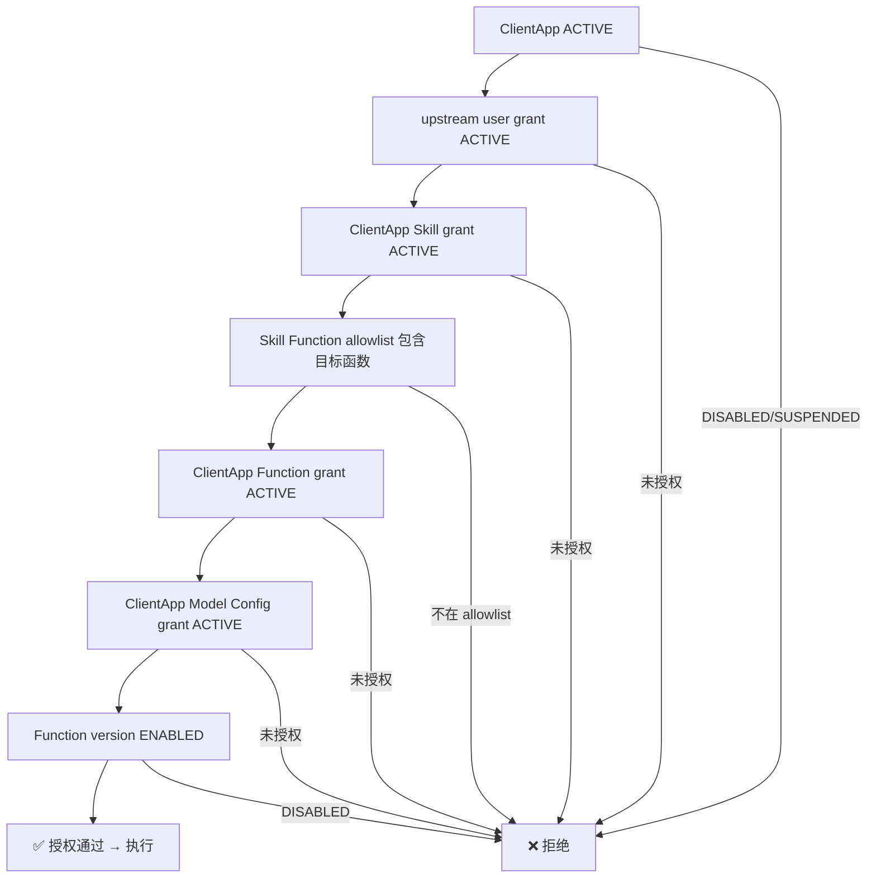

# Skill、用户、模型授权

## 文档作用

- doc_type: integration-guide
- version: 1.1.3-SNAPSHOT
- status: draft
- date: 2026-05-04
- intended_for: platform-admin | upstream-backend-developer
- purpose: 说明 Skill 初始化、用户授权、Skill 授权和模型授权链路

## 授权总览

Business Agent 运行时执行一个业务函数前，必须通过完整的授权链。任一环节不满足，调用将被 fail-closed 拒绝。



## Skill 初始化

### 1.1.3 Skill 注册口径

当前控制面通过 `SkillRegistryController` 注册 tenant 作用域 Skill，再通过 `ClientAppSkillGrant` 显式授权给 ClientApp。首版不在 `SkillEntity` 中落 `account_skill` / `client_app_skill` / `builtin_public_skill` 来源字段，外部文档不要依赖这些分类做运行时判定。

> **注**：`role_skill` 本版本延期，不参与 1.1.3 的 Skill 暴露和授权计算。

### 创建 Skill

```text
POST /api/v1/business-agent/skills
```

请求体示例字段：

```yaml
skillId: order-assistant
name: 订单助手
description: 查询、取消和退款订单
status: ENABLED
```

### 绑定函数到 Skill（Function Allowlist）

```text
POST /api/v1/business-agent/skills/{skillId}/functions
```

将已注册的 Business Function 加入 Skill 的函数白名单。

请求体示例字段：

```yaml
functionId: tms.order.get
status: ENABLED
```

> **规则**：Skill 只能调用其 allowlist 中的函数。Worker 调用时 Java 会校验当前 `skillId` 是否包含目标函数。

## 用户授权

### 授权 upstream user

```text
POST /api/v1/business-agent/client-apps/{clientAppId}/upstream-users
```

将上游用户 ID 授权为 ClientApp 下的有效用户。

请求体示例字段：

```yaml
upstreamUserId: u-10001
status: ENABLED
```

### 更新用户授权状态

```text
PUT /api/v1/business-agent/client-apps/{clientAppId}/upstream-users/{upstreamUserId}/status
```

支持启用/禁用某个 upstream user 的授权。

> **约束**：`upstream_user_id` 仅在 `clientAppId` 下唯一，不等同于 Navigator 内部用户。Java 会将 `client_app_id + upstream_user_id` 映射为 `navigator_effective_user_id`（推荐使用 `service_account_with_actor` 模式）。

## Skill 授权

### 授权 Skill 给 ClientApp

```text
POST /api/v1/business-agent/client-apps/{clientAppId}/skill-grants
```

将 Skill 授权给 ClientApp 使用。

请求体示例字段：

```yaml
skillId: order-assistant
status: ENABLED
```

> **规则**：
> - ClientApp 只能使用被显式 grant 的 Skill。
> - ClientApp Skill 不能越过 Java Registry 调用未授权 Business Function。
> - Client App 不能发布、升级或复制为平台公共技能。

## 模型授权

### LLM 配置归属

1.1.3 中 LLM 模型配置落在 **ClientApp Model Config Grant** 上，而不是个人用户配置上。

```text
Client App business session
  -> client_app_model_config_grant
  -> LlmModelConfigEntity
  -> LangGraph Biz Worker routing
```

### 授权模型配置

```text
POST /api/v1/client-apps/{clientAppId}/model-config-grants
```

将已有的 `LlmModelConfig` 授权给 ClientApp。

请求体示例字段：

```yaml
modelConfigId: llm-model-config-001
isDefault: true
grantScope: app
```

约束：

- `modelConfigId` 必须存在且属于同一 `tenantId`
- `workerBackend` 必须为 `LANGGRAPH_BIZ`
- 同一 ClientApp 不能重复授权同一 `modelConfigId`

### 查询可用模型

```text
GET /api/v1/client-apps/{clientAppId}/model-config-grants
```

### 设置默认模型

```text
PUT /api/v1/client-apps/{clientAppId}/model-config-grants/{grantId}/default
```

### 模型解析规则

创建 business task 时：

1. 如果请求指定 `requestedModelConfigId` → 必须命中 enabled grant，不合法直接异常，**不回退默认**
2. 未指定 → 使用 enabled default grant，没有默认模型直接异常
3. task/session 固定最终 `modelConfigId`，后续 resume 和继续会话**不得漂移**

### 启停模型授权

```text
PUT /api/v1/client-apps/{clientAppId}/model-config-grants/{grantId}/status
```

## 授权判定链汇总

运行时每次业务函数调用，Java 按以下顺序执行校验：

```mermaid
flowchart LR
    R[Task-scoped token valid] --> A
    A[ClientApp ACTIVE] --> B[upstream user ACTIVE]
    B --> C[Skill grant ACTIVE]
    C --> D[Function in Skill allowlist]
    D --> E[Function grant ACTIVE]
    E --> F[Model Config grant ACTIVE]
    F --> G[Function version ENABLED]
    G --> H[Approval / Idempotency / Audit]
    H --> I[✅ Execute]
```



任一环节失败 → fail-closed 返回业务异常，不降级。

## SDK 状态

> **SDK 待补齐**：上述 Skill、User Grant、Model Config Grant 的管理 API 当前 `navigator-open-sdk` 尚未封装。请使用 REST API。
