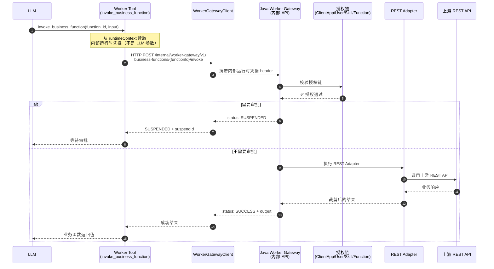

# 会话、任务与消息流

## 文档作用

- doc_type: integration-guide
- version: 1.1.3-SNAPSHOT
- status: draft
- date: 2026-05-04
- intended_for: upstream-backend-developer | upstream-frontend-developer
- purpose: 说明上游如何启动会话/任务、理解消息流，以及 Worker 工具调用链中的内部运行时凭据

## 会话 / 任务模型

| 概念 | 说明 | 对外暴露 |
| --- | --- | --- |
| **Task** | 一次具体的业务任务执行 | `taskId` 对外暴露 |
| **Session** | 会话上下文，可包含多个 Task | `contextId` / `sessionId` |
| **Message** | 任务执行中产生的消息 | 对外暴露 |

### 创建 Business Task

```text
POST /api/v1/business-agent/tasks
```

请求体示例字段：

```yaml
clientAppId: cap_xxx
sessionId: sess_001
upstreamUserId: u-10001
skillId: order-assistant
workerPoolId: pool_langgraph_biz
requestedModelConfigId: llm-model-config-001   # 可选
resumeFromTaskId: bt_previous                  # 可选
```

Java 在创建 task 时执行以下步骤：

1. 校验 ClientApp 状态（ACTIVE）
2. 校验 upstream user 授权
3. 解析并固定最终 `modelConfigId`（不漂移）
4. 选择 Biz Worker Pool
5. 签发内部运行时凭据并注入运行时 token store
6. 返回 `taskId`、`sessionId` 和一次性 `taskScopedToken`

### 查询 Task

```text
GET /api/v1/business-agent/tasks/{taskId}
```

### 查询 Session 下的 Task 列表

```text
GET /api/v1/business-agent/sessions/{sessionId}/tasks
```

## 内部运行时凭据

> **⚠️ 关键概念**：`task_scoped_token` 是 Java 签发给 Worker 的**内部运行时凭据**，由框架注入工具的 `runtimeContext`，**不暴露给 LLM 或前端**。

- Worker 工具的 `getParameters()` 方法**不包含** `task_scoped_token` 属性
- Worker 工具的 `execute()` 方法只从 `runtimeContext` 读取 token
- LLM 看到的工具 schema 中**没有** `task_scoped_token` 参数
- 上游后端即使从创建 task 响应中收到一次性 `taskScopedToken`，也只能把它视为 Worker bootstrap 内部凭据；不得写入前端响应、日志、LLM 上下文或业务数据库明文字段

## Worker 工具调用链

当 LLM 决定调用一个业务函数时，完整链路如下：



## Worker 标准工具

Worker 不直接注册业务 API。Worker 只注册平台标准工具，通过 Java Worker Gateway 间接访问业务函数：

| Worker 工具 | 用途 |
| --- | --- |
| `list_business_functions` | 查询当前 task 可见的函数摘要 |
| `get_business_function_schema` | 获取函数 schema、风险等级和审批信息 |
| `invoke_business_function` | 调用函数（可能触发 suspension） |
| `run_business_script` | 占位工具（fsscript 运行时未接入） |

> **注**：Worker Gateway 是**内部 API**（`/internal/worker-gateway/v1/**`），仅供受信 Worker 调用，不对上游系统开放。

## 消息流

### SDK 方式（推荐）

上游后端通过 SDK 轮询任务增量消息：

```java
String cursor = null;
while (!task.isTerminal()) {
    TaskMessagesPage page = client.agents()
        .getTaskMessages(agentId, taskId, 50, cursor);
    for (SessionMessage msg : page.getMessages()) {
        // 处理消息：文本、工具调用、审批等
    }
    cursor = page.getNextCursor();
    Thread.sleep(3000);
}
```

### 前端组件方式（推荐）

上游前端通过 `@foggy/chat` 的 SSE 客户端订阅消息流：

```typescript
import { createSseClient, useChatStore } from '@foggy/chat'

const chatStore = useChatStore()
createSseClient({
  url: '/bff/events/stream',   // 通过 BFF 代理
  adapter: yourAdapter,
  sessionId: 'xxx',
  onMessage: (messages) => {
    for (const m of messages) {
      chatStore.processAipMessage(m)
    }
  },
})
```

### REST 方式（兜底）

```text
GET /api/v1/business-agent/tasks/{taskId}     # 任务状态
```

增量消息目前通过 SDK 的 `AgentApi.getTaskMessages()` 获取；Business Agent 专属的增量消息 REST API 后续补齐。

## SDK 状态

| 能力 | SDK 状态 |
| --- | --- |
| 发起普通 Agent 任务、轮询、增量消息 | ✅ 已有（`AgentApi`） |
| 创建 Business Agent Task | ❌ SDK 待补齐（当前 REST） |
| 查询 Business Task 状态 | ❌ SDK 待补齐（当前 REST） |
