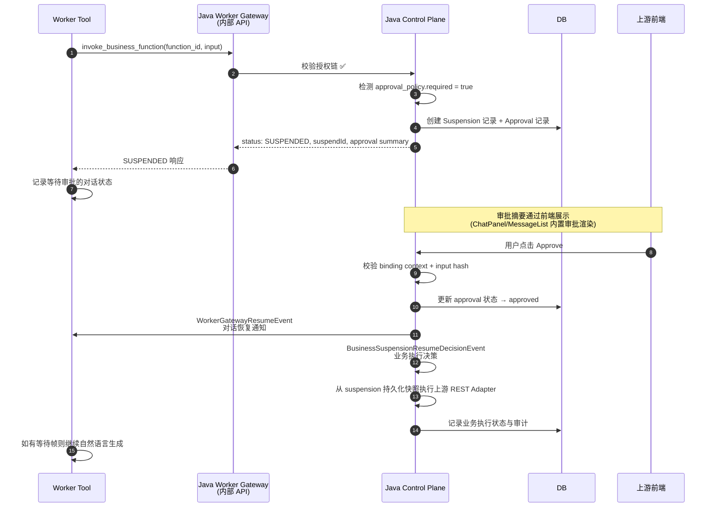

# 审批与 Suspension 流

## 文档作用

- doc_type: integration-guide
- version: 1.1.3-SNAPSHOT
- status: draft
- date: 2026-05-06
- intended_for: upstream-backend-developer | upstream-frontend-developer
- purpose: 说明需要审批的函数如何挂起、如何恢复，以及 input hash / binding context 的安全作用

## 概述

当业务函数的 `approval_policy.required = true` 时，调用会被挂起（suspended），等待审批后才能真正执行上游副作用操作。

**核心原则**：

- Java Control Plane 是审批状态、输入哈希和绑定上下文的所有者
- Java Suspension service 是审批通过后业务副作用执行的所有者
- Worker 不能自批准
- Worker resume 只用于对话状态通知和后续自然语言继续生成，不拥有业务函数执行权
- 前端和 LLM 不接触内部恢复凭据或 task scoped token
- Resume 必须走 Java Control Plane

## Suspension 触发

当 Worker 通过 `invoke_business_function` 调用一个需要审批的函数时：



> **Stage 12 语义**：审批通过后的真实业务函数执行由 Java Gateway/Suspension service 负责。Worker resume 不再作为“重新进入工具调用并再次 invoke”的执行路径；Worker 找不到 active waiting frame 时也不得触发业务副作用补救执行。

## Resume 端点

Resume **必须**走 Java Control Plane，**不是** Worker Gateway：

```text
POST /api/v1/business-agent/suspensions/{suspendId}/resume
```

请求体：

```json
{
  "approval_result": {
    "approval_id": "ap_001",
    "status": "approved",
    "approved_by": "u_001",
    "approved_at": "2026-05-04T10:00:00"
  },
  "binding_context": {
    "client_app_id": "cap_xxx",
    "upstream_user_id": "u_10001",
    "task_id": "bt_xxx",
    "session_id": "sess_001",
    "function_id": "tms.order.cancel_order",
    "version": "v1",
    "input_hash": "sha256..."
  }
}
```

> **⚠️ Worker Gateway 不暴露 Resume API**。Resume 请求只能发给 Java Control Plane。

## Input Hash 与 Binding Context

Java 在创建 Suspension 时记录以下绑定信息：

| 字段 | 安全作用 |
| --- | --- |
| `input_hash` (SHA-256) | 确保 resume 时函数输入与挂起时一致，防止篡改 |
| `client_app_id` | 确保同一 App 发起和恢复 |
| `upstream_user_id` | 确保同一用户 |
| `task_id` / `session_id` | 确保同一任务上下文 |
| `function_id` | 确保同一函数 |
| `script_run_id` | 确保同一脚本运行（如适用） |

Resume 时 Java 执行严格校验：

1. `suspendId` 存在且状态为 `SUSPENDED`
2. Binding context 完全匹配
3. Input hash 匹配
4. 未过期
5. 已批准的业务执行未完成或未在进行中

任一校验失败 → fail-closed 拒绝，记录审计日志。

## Resume 后的执行与幂等

Resume 接受审批结果后会拆成两条明确路径：

| 路径 | 事件 | 所有者 | 作用 |
| --- | --- | --- | --- |
| Worker 对话恢复通知 | `WorkerGatewayResumeEvent` | LangGraph Biz Worker | 通知对话可继续生成，找不到等待帧时记录后停止 |
| 业务执行决策 | `BusinessSuspensionResumeDecisionEvent` | Java Suspension service | 在服务端使用 suspension 快照执行受控业务函数 |

幂等策略：

- 同一 `suspendId` 重复 approve/resume 时，Java 会在 suspension 行锁内检查状态。
- 已进入 `businessExecutionStatus=IN_PROGRESS` 或 `COMPLETED` 的 suspension 不会再次调用上游业务接口。
- 重复 resume 可以被记录为跳过或已处理，但不得重复产生业务副作用。
- Worker notification 失败不等于业务执行失败；两者分别记录状态和审计。

## 拒绝和超时

```text
POST /api/v1/business-agent/suspensions/{suspendId}/resume
```

```json
{
  "approval_result": {
    "status": "rejected",
    "comment": "用户拒绝提交关单申请"
  },
  "binding_context": {
    "client_app_id": "cap_xxx",
    "upstream_user_id": "u_10001",
    "task_id": "bt_xxx",
    "session_id": "sess_001",
    "function_id": "tms.order.cancel_order",
    "version": "v1",
    "input_hash": "sha256..."
  }
}
```

拒绝、过期或 resume 校验失败时，Java 不会执行业务副作用，并会通过 Worker 对话通知让后续自然语言反馈用户。Worker 不得自动重试高风险操作。

## 前端审批 UI

`@foggy/chat` 提供两类前端表面：

1. `ChatPanel` / `MessageList` 会根据审批状态渲染内联审批卡片：

- 状态 `pending`：显示 Approve / Reject 按钮
- 状态 `approved`：绿色已批准标识
- 状态 `rejected`：红色已拒绝标识

2. `BusinessSuspensionDialog` 提供受控弹窗组件，用于上游业务系统在聊天卡片外展示更明确的确认对话框。

前端点击审批按钮后，应通过上游 BFF 转发到 Java Control Plane 的 Resume 端点。

> **⚠️ 前端不直接调用 Resume API**。应通过 BFF 层转发，由 BFF 注入必要的认证信息，并在服务端保存或获取 binding context。

## 恢复凭据安全

内部恢复凭据、`task_scoped_token`、输入哈希原文、上游用户 token 和敏感绑定上下文**不得**出现在：

- LLM prompt
- Skill/SKILL.md
- Worker retained message
- FSScript 变量
- Artifact
- SSE 普通文本事件
- 前端 localStorage/sessionStorage
- 前端组件 props 中的任意展示字段

确认码只在 Java 和用户确认界面之间流转。

## SDK 状态

`navigator-open-sdk` 已提供 `client.businessAgent().resumeSuspension()`。上游 BFF 推荐使用 SDK 调用；REST API 仍作为协议参考和 SDK 未覆盖能力的兜底。
